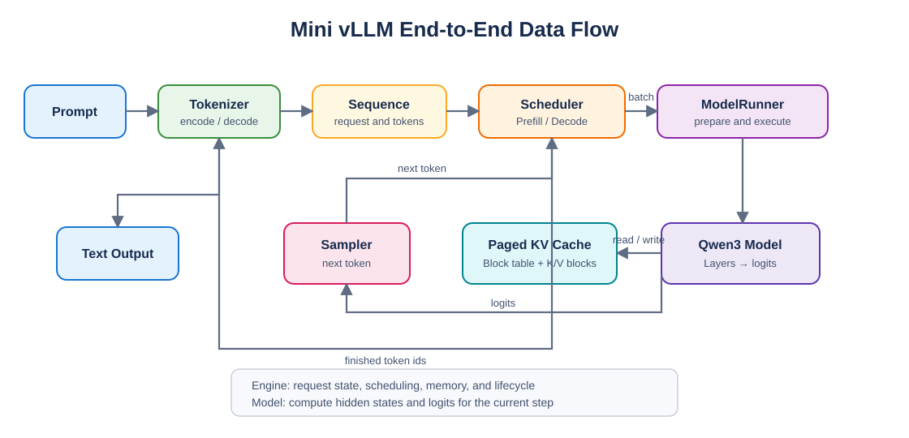
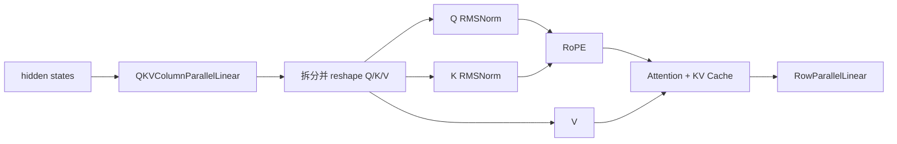
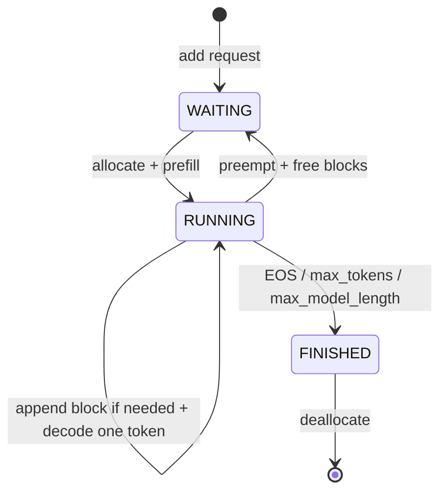

# Mini vLLM 从 0 到 1 复现手册

> 本手册以 `HowToApproachvLLM_zh.md` 的六个步骤为主纲，并接入本仓库已经完成的 [Day 1：模型结构与激活函数](day1/Day1.md) 和 [Day 2：RMSNorm](day2/Day2.md)。目标不是一次性复制参考项目，而是按照“理解原理 → 编写最小实现 → 验证正确性 → 再做性能优化”的顺序，逐步实现一个能够运行 Qwen3-0.6B 的 Mini vLLM 推理引擎。

## 0. 使用说明

### 0.1 当前进度

| 主纲 | 当前状态 | 本仓库材料 | 下一步 |
| --- | :---: | --- | --- |
| Step 1.1 激活函数 | ✅ 已完成 | [Day1](day1/Day1.md)、`day1/layers/activation.py` | 保留正确性与性能测试 |
| Step 1.2 RMSNorm | ✅ 已完成 | [Day2](day2/Day2.md)、`day2/layers/layernorm.py` | 与 Qwen3 Decoder 对接 |
| Step 1.3～1.6 其余基础层 | ⬜ 待实现 | 本手册给出接口和验收项 | 线性层 → Embedding → Attention → RoPE |
| Step 2 模型构建 | ⬜ 待实现 | Day1 已介绍 Qwen3-0.6B 结构 | 组装 Decoder 和完整模型 |
| Step 3 序列管理 | ⬜ 待实现 | 本手册给出数据结构 | Sequence → Block → BlockManager |
| Step 4 Model Runner | ⬜ 待实现 | 本手册给出输入张量契约 | 先 eager，再 CUDA Graph |
| Step 5 Scheduler | ⬜ 待实现 | 本手册给出调度状态机 | Prefill/Decode 调度与抢占 |
| Step 6 LLM Engine | ⬜ 待实现 | 本手册给出端到端流程 | tokenizer → 调度 → 推理 → 解码 |

这里的“已完成”只表示对应的教学代码和局部测试已经完成，不代表完整推理引擎已经完成。

### 0.2 环境约定

本教程基于 Linux/WSL 和 NVIDIA GPU：

- 当前 Day1/Day2 实测环境：Python 3.10.19、PyTorch 2.10.0+cu128、CUDA Runtime 12.8、RTX 5060 Laptop GPU 8 GB。
- `cuda129_py310` 是 Conda 环境名称，不代表 PyTorch 一定使用 CUDA 12.9；以 `torch.version.cuda` 为准。
- 参考项目的 `pyproject.toml` 要求 Python `>=3.11,<3.12`。复现完整引擎时建议新建 Python 3.11 环境；仅运行当前 Day1/Day2 示例时可继续使用现有环境。
- 下载 Qwen 模型前，需要能够访问 Hugging Face，并在受限模型要求登录时执行 `huggingface-cli login`。

```bash
# Windows 项目路径 D:\githubproject\vllm_from_0_to_1 对应的 WSL 路径
cd /mnt/d/githubproject/vllm_from_0_to_1

source ~/miniconda3/etc/profile.d/conda.sh
conda activate cuda129_py310

python - <<'PY'
import torch
print("PyTorch:", torch.__version__)
print("CUDA runtime:", torch.version.cuda)
print("GPU:", torch.cuda.get_device_name(0))
PY
```

完整项目建议最终形成下面的结构：

```text
src/myvllm/
├── layers/
│   ├── activation.py
│   ├── layernorm.py
│   ├── linear.py
│   ├── embedding_head.py
│   ├── attention.py
│   ├── rotary_embedding.py
│   └── sampler.py
├── models/
│   └── qwen3.py
├── engine/
│   ├── sequence.py
│   ├── block_manager.py
│   ├── model_runner.py
│   ├── scheduler.py
│   └── llm_engine.py
├── utils/
│   ├── context.py
│   └── loader.py
└── sampling_parameters.py
```

### 0.3 先建立整体认识



可编辑源文件：[figures/minivllm_overview.drawio](figures/minivllm_overview.drawio)。使用 Draw.io/diagrams.net 打开后，可以继续调整布局并重新导出 SVG 或 PNG。

模型层负责“算出下一个 token 的分布”，引擎层负责“哪些请求现在运行、KV Cache 放在哪里、什么时候结束”。复现时不要先写 Engine；底层张量计算不正确，上层调度越完整越难排错。

---

## Step 1：Layers

这一阶段只实现独立层。每个层都应先与 PyTorch 参考实现对齐，再讨论 `torch.compile`、Triton 或 CUDA Graph。

### 1.1 激活函数

详细原理、图像与实测结果见 [Day 1](day1/Day1.md)。Qwen3 MLP 使用 SwiGLU 风格的 `SiluAndMul`：输入最后一维被均分为 gate 和 up 两部分。

```python
import torch
import torch.nn.functional as F


class SiluAndMul(torch.nn.Module):
    def forward(self, x: torch.Tensor) -> torch.Tensor:
        gate, up = x.chunk(2, dim=-1)
        return F.silu(gate) * up
```

张量契约：输入 `[..., 2 * intermediate_size]`，输出 `[..., intermediate_size]`。`F.silu` 只接收待激活张量；乘法必须单独写成 `F.silu(gate) * up`。

验收：

- 最后一维为奇数时应主动报错或由 `chunk` 后的形状错误暴露问题。
- eager 与 compiled 输出使用 `torch.testing.assert_close` 对齐。
- CUDA Event 计时前先预热，计时区间前后执行同步，不把首次编译时间算入稳态耗时。

### 1.2 RMS LayerNorm

矩阵推导、残差路径和实测结果见 [Day 2](day2/Day2.md)。RMSNorm 不减均值，只用均方根调整最后一维的尺度：

$$
\mathrm{RMSNorm}(x)=\frac{x}{\sqrt{\mathrm{mean}(x^2)+\epsilon}}\odot\gamma
$$

带 residual 的路径不是拼接，而是逐元素相加：

```python
def residual_rms_forward(x, residual):
    residual = x + residual
    return rms_norm(residual), residual
```

第一层 Decoder 的 `residual=None` 只表示需要先保存最初的 Embedding 输出，并不表示第一层没有残差连接。其核心关系仍然是：

```text
h = embedding_output
h = h + attention(RMSNorm(h))
h = h + MLP(RMSNorm(h))
```

验收：基础路径和 residual 路径分别与 `torch.nn.functional.rms_norm` 或手写高精度参考实现比较；覆盖二维、三维输入以及 `float32`/`float16`。

### 1.3 支持张量并行的线性层

目标文件：`src/myvllm/layers/linear.py`。

建议按照以下顺序实现：

1. `LinearBase`：保存输入/输出维度、权重和可选 bias，并定义 `weight_loader`。
2. `ReplicatedLinear`：每个 rank 保存完整权重，作为正确性基线。
3. `ColumnParallelLinear`：沿输出维度切分权重，每个 rank 得到一部分输出。
4. `RowParallelLinear`：沿输入维度切分权重，各 rank 的局部结果通过 `all_reduce` 相加。
5. `MergedColumnParallelLinear`：把 MLP 的 gate/up 投影合并，但加载 checkpoint 时仍能分别定位两个分片。
6. `QKVColumnParallelLinear`：合并 Q/K/V 投影，同时正确处理 GQA 中 Q head 和 KV head 数量不同的问题。

若完整权重为 $W\in\mathbb{R}^{O\times I}$：

- Column Parallel：沿 $O$ 切分，各 rank 计算不同输出列，通常不需要立刻通信。
- Row Parallel：沿 $I$ 切分，各 rank 得到部分和，必须 `all_reduce` 才是完整结果。

权重加载不能简单地把完整 checkpoint 张量复制给每个 rank。每个参数应携带自己的 `weight_loader`，根据 rank 和分片维度执行 `narrow`/切片，再复制到本地参数。

最小验证方式：

```bash
# 单卡先验证普通线性层
python src/myvllm/layers/linear.py

# 多卡张量并行；按实际 GPU 数调整 nproc_per_node
torchrun --standalone --nproc_per_node=2 src/myvllm/layers/linear.py
```

验收：使用同一份完整权重构造 PyTorch 基线，并在随机输入上验证分片层输出 `allclose`。测试必须覆盖 bias、有/无 gather、Merged gate/up 和 GQA QKV 四种情况。

### 1.4 Vocab Embedding 与 LM Head

目标文件：`src/myvllm/layers/embedding_head.py`。

`VocabParallelEmbedding` 沿词表维度切分 embedding 权重。每个 rank 只处理落入本地词表区间的 token，区间外位置先置零，随后对各 rank 的结果执行 `all_reduce`，得到完整 embedding。

```text
rank 0: token [0, vocab/TP)
rank 1: token [vocab/TP, 2*vocab/TP)
...
```

`ParallelLMHead` 可复用相同的分片权重，把 hidden states 映射为局部词表 logits，再根据采样策略决定是否 `all_gather` 完整 logits。若配置 `tie_word_embeddings=True`，Embedding 和 LM Head 必须引用同一个参数，而不是数值相同的两份副本。

注意：通信后的张量可能不是连续内存。在 `view` 前先检查 `is_contiguous()`，必要时调用 `contiguous()`；否则应使用能够处理非连续布局的 `reshape`。

验收：

- 词表大小不能整除 TP 数时，明确选择 padding 或不均匀分片策略。
- 边界 token（每个 rank 的起止 id）必须有测试。
- tied weight 使用对象身份或 `data_ptr()` 验证确实共享存储。
- 分片输出聚合后与普通 `nn.Embedding` 和 `nn.Linear` 对齐。

### 1.5 Attention：FlashAttention、PagedAttention 与 KV Cache

目标文件：`src/myvllm/layers/attention.py`。这是整个复现中最容易出错的部分，建议拆成“存缓存、Prefill、Decode”三个独立测试。

#### 1.5.1 两种优化解决的问题不同

- FlashAttention 解决计算问题：以 block 为单位加载 Q/K/V，并使用 online softmax，避免保存完整的 $N\times N$ attention matrix。
- PagedAttention 解决存储和调度问题：把每条序列的 KV Cache 放入非连续物理块，通过 block table 完成逻辑块到物理块的映射。

它们可以同时存在：Prefill 使用 FlashAttention，Decode 从 paged KV Cache 中读取历史 K/V。

#### 1.5.2 KV Cache 布局

推荐布局：

```text
(num_blocks, block_size, num_kv_heads, head_dim)
```

一个元素的扁平偏移为：

$$
((block\_id\cdot block\_size+offset)\cdot num\_kv\_heads+kv\_head)\cdot head\_dim+d
$$

其中 `block_id = slot // block_size`，`offset = slot % block_size`。`slot_mapping` 必须存物理 slot，而不是序列内的 token 下标。

#### 1.5.3 写入新 K/V

`store_kvcache(k, v, k_cache, v_cache, slot_mapping)` 把本轮 token 的 K/V 写入指定物理位置。先写纯 PyTorch scatter 版本作为参考，再写 Triton kernel。

验收：使用随机且非连续的 `slot_mapping`，检查每个目标位置以及未写位置。不要只用顺序 block id，否则会掩盖地址映射错误。

#### 1.5.4 Prefill：变长 FlashAttention

多个 prompt 可以打包为一个连续 token 张量，`cu_seqlens_q`/`cu_seqlens_k` 描述各序列边界：

```text
lengths     = [3, 5, 2]
cu_seqlens = [0, 3, 8, 10]
```

每个序列只能关注自己的历史 token，并应用 causal mask。online softmax 的稳定递推可写为：

$$
m_{new}=\max(m_{old}, \max(s))
$$

$$
\alpha=\exp(m_{old}-m_{new})
$$

$$
l_{new}=\alpha l_{old}+\sum\exp(s-m_{new})
$$

$$
acc_{new}=\alpha acc_{old}+\sum\exp(s-m_{new})V
$$

最后输出 `acc / l`。每次最大值变化时，旧的分母与累积向量都要乘同一个 $\alpha$。

#### 1.5.5 Decode：读取 paged cache

Decode 时每个序列通常只有一个 query，但要读取全部历史 K/V：

```text
logical token index
  -> logical_block = index // block_size
  -> block_offset  = index % block_size
  -> physical_block = block_table[logical_block]
  -> k_cache/v_cache[physical_block, block_offset, kv_head, :]
```

GQA 中多个 query heads 共享一个 KV head。常用映射是：

```python
queries_per_kv = num_q_heads // num_kv_heads
kv_head = q_head // queries_per_kv
```

必须保证 `num_q_heads % num_kv_heads == 0`。

#### 1.5.6 高频错误

- 把序列内 token 位置直接当成物理 cache slot。
- 每个 token 都重新读取 block table，而不是按 chunk/逻辑块复用映射。
- 被 mask 的 Triton lane 仍参与非法地址计算；安全做法是先把无效 lane 指向合法哨兵地址，再用 mask 禁止读写。
- 地址中间量使用 `int32`，在大 cache 下溢出；偏移计算应使用足够宽的整数类型。
- 只用 `block_table=[0,1,2,...]` 测试，逻辑/物理映射写反也不会暴露。
- 忘记 causal mask、序列边界或最后一个不完整 block。

#### 1.5.7 验收顺序

1. 用小张量与朴素 PyTorch attention 对齐。
2. 覆盖不同序列长度、非整 block 长度、随机 block table、GQA/MHA。
3. 分别测试 KV 写入、Prefill 输出、Decode 输出。
4. 通过正确性测试后再运行延迟和显存基准。

### 1.6 RoPE

目标文件：`src/myvllm/layers/rotary_embedding.py`。RoPE 只应用于 Q/K，不应用于 V。将最后一维按偶数/奇数或前半/后半配对旋转，但实现和 checkpoint 约定必须一致。

```python
def rotate_half(x):
    x1, x2 = x.chunk(2, dim=-1)
    return torch.cat((-x2, x1), dim=-1)

q = q * cos + rotate_half(q) * sin
k = k * cos + rotate_half(k) * sin
```

频率通常由 `rope_theta`（也称 `base`）和 head dimension 生成。Qwen3-0.6B 的配置必须读取模型配置，不能默认沿用旧模型常见的 10000。长上下文扩展策略（直接增大 base、位置缩放、NTK/YARN 等）不要混在基础实现里；先复现原配置。

验收：位置 0、连续位置、Prefill packed positions 和逐 token Decode positions 都要与 Hugging Face 对齐；同时检查 dtype/device，避免 cos/sin cache 导致隐式搬运。

---

## Step 2：模型构建

目标文件：`src/myvllm/models/qwen3.py`。Day1 已展示 Qwen3-0.6B 的模块结构，组装时按由小到大的顺序实现。

### 2.1 Qwen3Attention

数据流：



每个 rank 只处理本地 heads。Q/K 的 RMSNorm 作用于 `head_dim`；不要误用 Decoder 的 hidden-size RMSNorm 权重。

### 2.2 Qwen3MLP

```text
x -> MergedColumnParallelLinear(gate, up)
  -> SiluAndMul
  -> RowParallelLinear
```

合并 gate/up 是运行时布局；checkpoint 往往仍以 `gate_proj.weight` 和 `up_proj.weight` 分开存储，所以 loader 要根据参数名写入合并参数的正确分段。

### 2.3 Qwen3DecoderLayer

Decoder 采用 pre-norm，代码为减少中间张量，可能把残差加法放到“下一次 RMSNorm 调用”中。判断逻辑时应还原成下面的数学关系：

```text
h1 = h0 + Attention(RMSNorm(h0))
h2 = h1 + MLP(RMSNorm(h1))
```

`+` 是同形状张量逐元素加和，不是拼接。详细的跨层 residual 传递图见 [Day2](day2/Day2.md)。

### 2.4 Qwen3Model 与 Qwen3ForCausalLM

组装顺序：

```text
input_ids
 -> VocabParallelEmbedding
 -> N × Qwen3DecoderLayer
 -> final RMSNorm
 -> ParallelLMHead
 -> logits
 -> Sampler
```

配置值应从 Hugging Face `AutoConfig` 或本地配置文件读取。至少核对：`vocab_size`、`hidden_size`、`num_hidden_layers`、`num_attention_heads`、`num_key_value_heads`、`head_dim`、`intermediate_size`、`rope_theta`、`rms_norm_eps`、`tie_word_embeddings` 和 EOS id。

权重加载完成后，先用短序列、单 batch、eager 模式，在相同权重和 dtype 下与 Hugging Face 模型对齐 logits；不要一开始同时引入 TP、Triton 和 CUDA Graph。

验收：

- 所有 checkpoint key 都被加载或被明确列入可忽略项。
- 每一层参数 shape 与配置一致。
- 单 token/短 prompt 的 logits 与参考模型在合理误差内一致。
- tied embedding 确实共享参数。

---

## Step 3：序列管理

### 3.1 Sequence

目标文件：`src/myvllm/engine/sequence.py`。`Sequence` 是单个请求的可变状态，至少包含：

- 唯一 `seq_id`；
- `token_ids`，构造时复制输入列表，避免调用方修改原列表；
- prompt 长度与 completion token 数；
- `block_table`；
- `WAITING`、`RUNNING`、`FINISHED` 状态；
- temperature、max_tokens、max_model_length、ignore_eos 等采样参数。

派生量包括 `num_tokens`、`num_blocks`、`last_block_num_tokens` 和 `num_cached_blocks`。这些属性的边界行为必须统一，例如长度正好等于 block size 时，不能多申请一个块。

### 3.2 Block

目标文件：`src/myvllm/engine/block_manager.py`。一个物理块至少记录：

- `block_id`；
- `ref_count`，用于前缀缓存共享；
- 完整块的 token ids；
- 包含前缀上下文的 hash。

同一 token block 在不同前缀之后不能仅凭当前块 token 判定为相同，因此 hash 应包含 `prefix_hash`。hash 命中后仍应比较 token ids，避免碰撞造成错误复用。块从空闲池重新分配时，`ref_count` 应回到 1，而不是 0。

### 3.3 BlockManager

核心职责：

- `can_allocate(seq)`：Prefill 前判断整条序列需要的块是否可分配。
- `allocate(seq)`：优先复用可验证的缓存前缀，其余从 free list 分配。
- `can_append(seq)`：Decode 前判断追加一个 token 是否需要新块以及是否有空间。
- `append(seq)`：必要时给序列追加物理块。
- `deallocate(seq)`：递减引用计数，归零后放回 free list，并清空序列的 block table。

验收应覆盖：空序列、一个块、刚好跨块、多序列共享前缀、部分前缀命中、hash 冲突模拟、抢占后释放和重复分配。每次操作后都检查不变量：

```text
空闲块数 + ref_count > 0 的物理块数 = 总物理块数
free list 中无重复 block_id
运行中序列的 block_table 不引用空闲块
```

---

## Step 4：Model Runner

目标文件：`src/myvllm/engine/model_runner.py`。ModelRunner 是引擎状态与模型张量之间的桥梁。

### 4.1 初始化和权重加载

初始化设备、distributed process group、模型和权重。多卡时每个 rank 必须使用相同的 collective 初始化顺序，否则会在 NCCL barrier 中等待。为了减少 CPU 峰值内存，可以先把分片模型放到对应 GPU，再逐参数加载属于该 rank 的 checkpoint 分片。

### 4.2 共享内存通信

主 rank 通过 `call(method_name, *args)` 触发 worker 执行同一方法。共享内存消息要包含明确长度，例如前 4 bytes 存 payload 长度；写入完成后再触发 Event。worker 读取并反序列化后调用相应方法。

这条路径先验证单机双进程的简单整数/张量往返，再用于模型执行。错误的事件顺序可能造成读到半包或永久等待。

### 4.3 KV Cache 内存管理

先执行模型 warmup，记录模型本身的峰值显存，再按照可用显存预算分配 K/V cache：

```text
可用于 KV 的字节数
= 总显存 × gpu_memory_utilization
 - 当前模型与运行时占用
 - 安全余量

num_blocks = 可用于 KV 的字节数 // 单个 K/V block 字节数
```

一个 block 同时包含每层的 K cache 和 V cache。计算字节数时必须乘 `num_layers`、2（K 和 V）、`block_size`、`num_kv_heads`、`head_dim` 和 dtype bytes。

### 4.4 prepare_prefill

把多个变长序列打包，并产生：

- 扁平 `input_ids`；
- 与每个 token 对应的 `positions`；
- `cu_seqlens_q`/`cu_seqlens_k`；
- 每个新 token 的物理 `slot_mapping`；
- 前缀缓存需要的 `block_tables`；
- 最大 query/key 序列长度。

CPU 临时张量可放在 pinned memory，再使用 `non_blocking=True` 复制到 GPU。先保证数值正确，再验证异步拷贝是否真的生效。

### 4.5 prepare_decode

Decode 每条序列只输入最新 token。新 token 的 cache slot 应由物理 block table 计算：

```python
slot = seq.block_table[-1] * block_size + seq.last_block_num_tokens - 1
```

同时构造每条序列的 `context_lens` 和 padded `block_tables`。padding 值必须是 kernel 可安全处理的哨兵值，并配合长度 mask。

### 4.6 模型执行与采样

`run(seqs, is_prefill)` 的固定顺序：

```text
prepare_prefill / prepare_decode
 -> set_context
 -> run_model
 -> 取每条序列最后位置 hidden state
 -> compute_logits
 -> temperature sampling
 -> reset_context
```

只有 rank 0 需要输出采样 token，但所有 rank 必须按相同顺序参与模型中的 collective。

### 4.7 CUDA Graph

先在 eager 模式完成端到端正确性，再为 Decode 捕获 CUDA Graph。Graph 要求地址和控制流稳定，因此预先为若干 batch size 准备静态输入 buffer；实际 batch 向上取最近的已捕获大小，并用哨兵序列填充。

- `torch.compile` 优化/融合计算图中的算子与 kernel。
- CUDA Graph 记录并重放一串 GPU kernel，主要减少 Python 和 kernel launch 开销。

二者解决的问题不同，可以组合使用。不要把首次 compile/capture 时间计入稳态 benchmark。

---

## Step 5：Scheduler

目标文件：`src/myvllm/engine/scheduler.py`。维护 `waiting` 和 `running` 两个队列，并让 Prefill 和 Decode 共用 token、序列数与 KV blocks 三类预算。



推荐的最小调度策略：

1. 优先从 `waiting` 选择能够完整分配 KV blocks 且不超过 batch token/sequence 限制的 Prefill 请求。
2. 本轮若有 Prefill，返回 Prefill batch。
3. 否则从 `running` 为每条序列安排一个 Decode token。
4. cache 不足时抢占低优先级/队尾序列，释放其 blocks，并放回 waiting。
5. `postprocess` 追加采样 token；命中 EOS、`max_tokens` 或 `max_model_length` 时标记完成并释放 blocks。

调度器必须保证“每次调用有进展”：要么返回非空 batch，要么改变队列/释放资源，要么明确抛出无法满足容量的错误。绝不能在状态不变时返回空 batch，让 Engine 无限循环。

验收：

- Prefill 受 `max_num_batched_tokens` 和 `max_num_sequences` 限制。
- Decode 每条选中序列恰好增加一个 token。
- cache 不足时抢占且无 block 泄漏。
- 单条 prompt 永远无法放入 cache 时立即报出清晰错误。
- EOS、最大生成长度和最大总长度均能结束请求。

---

## Step 6：LLM Engine

目标文件：`src/myvllm/engine/llm_engine.py`。这一层只负责编排，不重新实现模型或 cache 逻辑。

### 6.1 初始化顺序

多卡时先启动 worker，再在 rank 0 创建 ModelRunner；所有 rank 都进入 distributed collective 后，才创建 Scheduler。若 rank 0 在其他 rank 加入前阻塞于 process-group 初始化，后续对象不会创建。

```text
spawn workers
 -> workers create ModelRunner
 -> rank 0 creates ModelRunner
 -> all ranks finish distributed init
 -> rank 0 creates Scheduler
```

### 6.2 核心接口

- `add_prompt(prompt, sampling_params)`：tokenize 后创建 Sequence，加入 waiting。
- `step()`：`schedule → model_runner.run → scheduler.postprocess`，返回本轮完成的请求。
- `generate(prompts, sampling_params)`：加入所有请求，循环 `step()` 直到调度器为空，按 `seq_id` 恢复原顺序并 decode。
- `exit()`：通知所有 worker 退出、join 子进程、释放共享内存和 distributed 资源；使用 `atexit` 作为兜底，但正常路径也应显式关闭。

### 6.3 端到端验收

按风险从低到高测试：

1. 单 GPU、单 prompt、eager、随机权重能够走完整流程。
2. 加载 Qwen3-0.6B 权重，短 prompt 的首 token logits/greedy token 与 Hugging Face 对齐。
3. 多 prompt 连续批处理，输出顺序与输入一致。
4. prompt 长度跨越多个 blocks，且 block table 使用随机物理 id。
5. 同前缀请求能够复用 cache，释放后 ref_count 恢复正确。
6. 连续批处理下发生抢占后仍能完成所有请求。
7. 打开 `torch.compile`，结果与 eager 一致。
8. 打开 CUDA Graph，Decode 结果与 eager 一致。
9. 最后才进行吞吐量、首 token 延迟、逐 token 延迟和峰值显存测试。

运行入口可以采用：

```bash
export PYTHONPATH="$PWD/src"
python main.py

# 有 pytest 后统一执行
python -m pytest -q
```

---

## 推荐推进顺序

这里的 Day 编号是后续写作建议，不改变 `HowToApproachvLLM_zh.md` 的六步主纲：

| 教程阶段 | 实现内容 | 必须交付的验证 |
| --- | --- | --- |
| Day1 | Qwen3 架构、激活函数、SiluAndMul | 图像、单元测试、compile benchmark |
| Day2 | RMSNorm 与 residual | 数值对齐、四种路径 benchmark |
| Day3 | TP Linear | 1/2 GPU 与完整 Linear 对齐 |
| Day4 | Vocab Embedding、LM Head、Sampler | 边界 token、tied weight、logits/采样测试 |
| Day5 | RoPE、Q/K RMSNorm | 与 Hugging Face 对齐 |
| Day6 | KV Cache 布局和写入 | 随机 slot_mapping 测试 |
| Day7 | Prefill FlashAttention | 变长、causal、非整块测试 |
| Day8 | Decode PagedAttention | 随机 block table、GQA 测试 |
| Day9 | Qwen3 模型组装与权重加载 | 层级输出和 logits 对齐 |
| Day10 | Sequence、Block、BlockManager | 状态和资源不变量测试 |
| Day11 | ModelRunner 数据准备 | Prefill/Decode 张量契约测试 |
| Day12 | Scheduler | 容量、抢占、停止条件测试 |
| Day13 | LLMEngine、TP、CUDA Graph | 端到端正确性与性能报告 |

## 统一测试与 benchmark 规范

### 正确性优先

每个优化实现都保留一个简单参考版本：

```python
actual = optimized_fn(*inputs)
expected = reference_fn(*inputs)
torch.testing.assert_close(actual, expected, rtol=1e-3, atol=1e-3)
```

半精度 attention 需要根据序列长度和累计误差调整容差，但不能只检查 shape 或 `isfinite()`。随机种子、dtype、device、输入 shape 和模型配置必须记录。

### GPU 计时

```python
for _ in range(warmup):
    fn(*inputs)
torch.cuda.synchronize()

start = torch.cuda.Event(enable_timing=True)
end = torch.cuda.Event(enable_timing=True)
start.record()
for _ in range(repeats):
    fn(*inputs)
end.record()
torch.cuda.synchronize()
latency_ms = start.elapsed_time(end) / repeats
```

报告中注明 GPU、Python、PyTorch、CUDA runtime、dtype、shape、warmup、repeats。`torch.compile` 首次编译和 CUDA Graph 首次 capture 单独报告，不混入稳态延迟。

### 每一阶段的完成定义

一个模块只有同时满足以下条件才算完成：

- 接口、输入输出 shape 和 dtype 契约有文档。
- 与简单参考实现数值对齐。
- 覆盖边界情况，而不只测试一个正常样例。
- 错误输入能给出可理解的异常。
- 性能测试可复现，并记录完整环境。
- 生成的缓存、临时 benchmark 脚本和本地模型素材未误提交 Git。

## 排错顺序

当完整模型输出错误时，从最底层向上检查：

```text
权重 key/shape
 -> RMSNorm、RoPE、SiluAndMul
 -> QKV 拆分和 GQA head 映射
 -> KV slot_mapping / block_table
 -> Prefill/Decode attention
 -> Decoder residual
 -> LM Head logits
 -> Sampler
 -> Scheduler 状态和结束条件
```

出现 CUDA 非法访存时，先设置 `CUDA_LAUNCH_BLOCKING=1` 缩小位置，并用小张量、顺序执行和 PyTorch 参考路径复现。出现多卡卡死时，检查所有 rank 是否以相同顺序进入 collective，而不是先增加超时。

## 后续教程文档模板

每个新的 `DayN.md` 建议保持下面的结构，便于持续复现而不偏离主纲：

```markdown
# Mini vLLM 教程：Day N

## 1. 本日目标
## 2. 原理与张量 shape
## 3. 最小 PyTorch 参考实现
## 4. Mini vLLM 实现
## 5. 正确性测试
## 6. 性能测试
## 7. 常见错误与结论
## 8. 下一步
```

每一篇开头注明它对应主纲的哪一节；每一篇结尾更新本手册“当前进度”。这样 Day 教程负责展开细节，本手册始终作为完整项目的导航和验收清单。

## 参考

- 本仓库：[Day 1：Qwen3 架构与激活函数](day1/Day1.md)
- 本仓库：[Day 2：RMSNorm 与 residual](day2/Day2.md)
- 复现主纲：`MinivLLM/HowToApproachvLLM_zh.md`
- 目标模型：`Qwen/Qwen3-0.6B`
