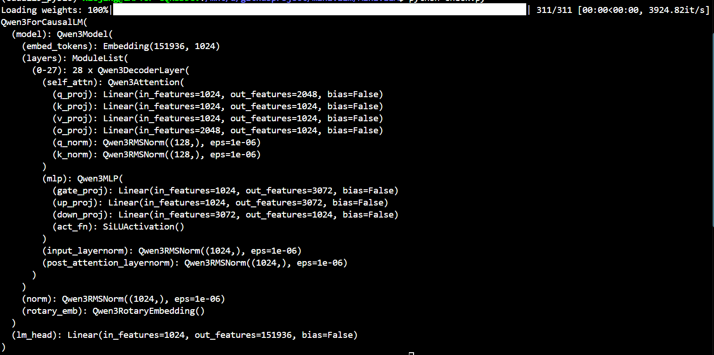
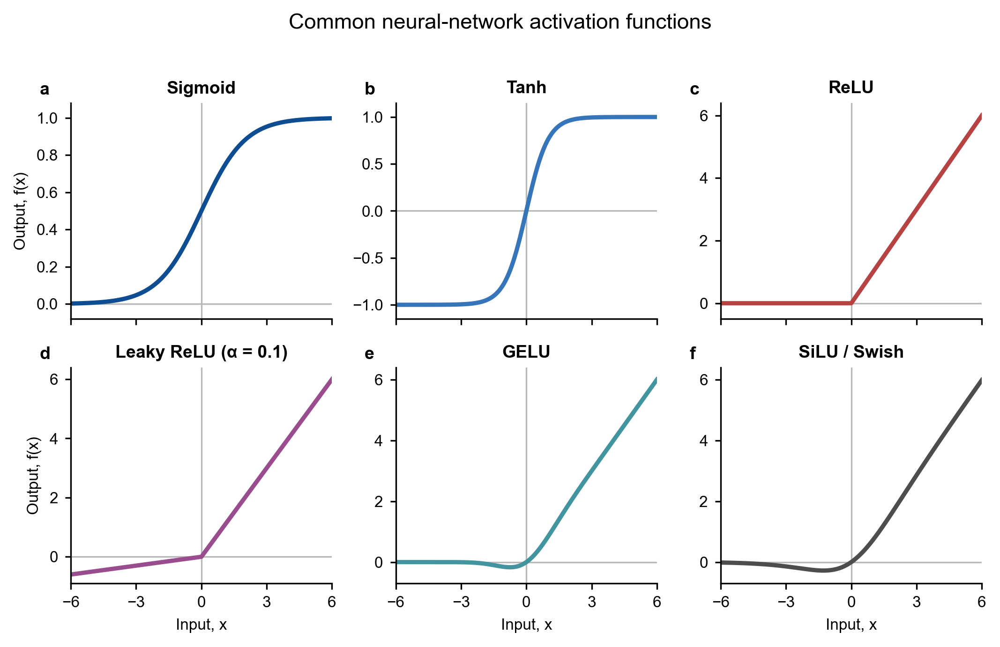

# Mini vLLM 教程：Day 1

## 教程环境

本教程基于 **Linux 环境**实现。后续命令默认在项目根目录下执行，并假设已经安装 Python、PyTorch 和项目所需依赖。

## 前置知识

开始本教程前，建议先了解：

- Hugging Face Transformers 的基本使用方法；
- Decoder-only Transformer 与 LLM 的基本架构；
- Python 基础语法；
- GPU 的基本架构与并行计算概念。

## 1. 查看 Qwen3-0.6B 模型架构

Day 1 首先了解 Qwen3-0.6B 的模型架构。项目中的 `qwen0.6B.py` 会下载并加载模型，然后在终端输出完整的模块结构。

安装依赖：

```bash
python -m pip install torch transformers
```

在 Linux 终端中执行：

```bash
python day1/qwen0.6B.py
```

首次执行时，Transformers 会从 Hugging Face Hub 下载模型文件，因此需要能够访问 Hugging Face，并确保本地具有足够的磁盘空间和内存。Qwen3-0.6B 是公开模型，通常不强制登录；如果下载环境要求身份验证，可以先注册 Hugging Face 账号并执行：

```bash
huggingface-cli login
```

终端输出的模型结构如下图所示：



终端输出能够列出模型中的全部模块，但不容易直接看出模块之间的数据流和连接关系。下面的结构图更清楚地展示了模型的整体连接方式：


如果已经了解 LLM 架构，可以将结构图与终端输出对应起来：

| 终端中的模块 | 结构图中的位置 | 作用 |
| --- | --- | --- |
| `embed_tokens` | Embedding | 将 token ID 转换为隐藏向量 |
| `rotary_emb` | Attention 内的 RotaryEmbedding | 旋转 Query 和 Key，为注意力计算注入位置信息 |
| `layers.0-27` | Decoder Layer × n | 重复堆叠 28 个 Decoder Layer |
| `self_attn` | Attention | 完成 token 之间的信息交互 |
| `q_proj`、`k_proj`、`v_proj` | Q/K/V Linear | 生成 Query、Key 和 Value |
| `q_norm`、`k_norm` | Q/K RMSNorm | 分别归一化 Query 和 Key 的每个 head |
| `o_proj` | Attention Output Linear | 将多头注意力结果映射回隐藏维度 |
| `input_layernorm` | Attention 前的 RMSNorm | 对 Attention 输入进行归一化 |
| `post_attention_layernorm` | MLP 前的 RMSNorm | 对 MLP 输入进行归一化 |
| `mlp` | MLP | 使用 Gate、Up、SiLU 和 Down 完成非线性变换 |
| `norm` | Final RMSNorm | 对所有 Decoder Layer 的最终输出进行归一化 |
| `lm_head` | Output | 将隐藏状态映射为词表 logits |

从当前终端截图还可以读出以下结构信息：

- 词表大小为 151,936，隐藏维度为 1,024；
- 模型包含 28 个 Qwen3 Decoder Layer；
- MLP 的中间维度为 3,072，并使用 SiLU 激活函数；
- Query 投影输出维度为 2,048，Key 和 Value 投影输出维度均为 1,024，体现了 GQA 的结构特点；
- 最后的 `lm_head` 将 1,024 维隐藏状态映射到 151,936 维词表 logits。

整体前向过程可以概括为：

```text
token IDs
  → Embedding
  → 28 × Decoder Layer
      → RMSNorm → Q/K/V 投影 → RoPE → Attention → 残差连接
      → RMSNorm → MLP（SiLU）→ 残差连接
  → Final RMSNorm
  → LM Head
  → logits
```

理解模型整体结构后，下一步从 Decoder Layer 中使用的激活函数开始，逐个学习和实现基础组件。

## 2. 激活函数是什么，为什么需要它

神经网络中的线性层执行仿射变换：

$$
\mathbf{y}=\mathbf{W}\mathbf{x}+\mathbf{b}.
$$

激活函数作用在线性层输出上。如果多个线性层之间没有激活函数，无论堆叠多少层，整体仍然等价于一次线性变换。激活函数为网络引入非线性，使模型能够拟合更复杂的关系。

## 3. 常见激活函数

### 3.1 Sigmoid

$$
\sigma(x)=\frac{1}{1+e^{-x}}.
$$

- 输出范围为 $(0,1)$，适合表示二分类概率或门控权重。
- 当 $|x|$ 较大时梯度接近 0，容易出现梯度消失。
- 输出不是以 0 为中心，因此通常不作为深层网络隐藏层的首选激活函数。

### 3.2 Tanh

$$
\tanh(x)=\frac{e^x-e^{-x}}{e^x+e^{-x}}.
$$

- 输出范围为 $(-1,1)$，且输出以 0 为中心。
- 与 Sigmoid 一样，在输入绝对值较大时会饱和并产生较小梯度。
- 常见于传统循环神经网络以及需要有界输出的场景。

### 3.3 ReLU

$$
\operatorname{ReLU}(x)=\max(0,x).
$$

- 计算简单，正半轴上的梯度恒为 1，有助于缓解梯度消失。
- 负半轴输出和梯度均为 0，神经元可能长期无法更新，即“死亡 ReLU”问题。
- 在 $x=0$ 处不可导；实际框架会约定一个次梯度，通常取 0。

### 3.4 Leaky ReLU

$$
\operatorname{LeakyReLU}(x)=
\begin{cases}
x, & x\geq 0,\\
\alpha x, & x<0.
\end{cases}
$$

- 在负半轴保留一个较小斜率，降低神经元完全“死亡”的风险。
- $\alpha$ 是可配置超参数；本示例使用 $\alpha=0.1$。

### 3.5 GELU

$$
\operatorname{GELU}(x)=x\Phi(x),
$$

其中 $\Phi(x)$ 是标准正态分布的累积分布函数。绘图脚本采用常用的 tanh 近似：

$$
\operatorname{GELU}(x)\approx
\frac{x}{2}\left[1+\tanh\left(\sqrt{\frac{2}{\pi}}
\left(x+0.044715x^3\right)\right)\right].
$$

- 函数平滑，并允许较小的负输出。
- 广泛用于 BERT、GPT 等 Transformer 模型。

### 3.6 SiLU（Swish）

$$
\operatorname{SiLU}(x)=x\sigma(x).
$$

- 函数平滑且在负半轴附近具有轻微的非单调性。
- 常用于现代卷积网络和大语言模型；SwiGLU 等门控结构也会使用 SiLU。

## 4. 激活函数特性对比

| 激活函数 | 输出范围 | 是否平滑 | 主要优点 | 主要局限 |
| --- | --- | --- | --- | --- |
| Sigmoid | $(0,1)$ | 是 | 适合概率和门控 | 易饱和、梯度消失、非零中心 |
| Tanh | $(-1,1)$ | 是 | 零中心、有界 | 易饱和、梯度消失 |
| ReLU | $[0,+\infty)$ | 否 | 简单高效、正区间梯度稳定 | 可能出现死亡神经元 |
| Leaky ReLU | $(-\infty,+\infty)$ | 否 | 负区间仍保留梯度 | 需要选择负斜率 $\alpha$ |
| GELU | 约 $[-0.17,+\infty)$ | 是 | 平滑，适合 Transformer | 计算量高于 ReLU |
| SiLU | 约 $[-0.28,+\infty)$ | 是 | 平滑、负区间保留信息 | 计算量高于 ReLU |

## 5. 使用 Matplotlib 绘制激活函数图像

安装依赖：

```bash
python -m pip install numpy matplotlib
```

在项目根目录运行：

```bash
python day1/activation_functions.py
```

脚本会在 `day1/figures/` 中生成以下文件：

- `activation_functions.png`：适合快速预览。
- `activation_functions.svg`：文字可编辑的矢量图。
- `activation_functions.pdf`：适合打印和文档引用。

## 6. 绘制结果



从图中可以观察到：Sigmoid 和 Tanh 在两端趋于饱和；ReLU 直接截断负输入；Leaky ReLU 为负输入保留小斜率；GELU 和 SiLU 则以平滑方式调节输入。
