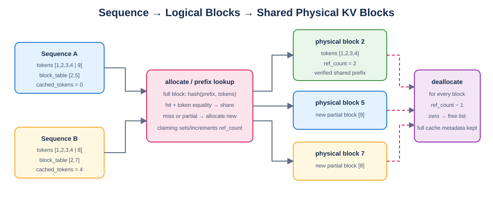

# Mini vLLM 教程：Day 10

> 对应 [Mini vLLM 复现手册](../MinivLLM复现手册.md) 的 Step 3。本章实现 Sequence、Block、BlockManager 和跨请求完整前缀复用。

## 1. Sequence

[`engine/sequence.py`](engine/sequence.py) 保存 token、状态、采样参数和 `block_table`。输入 token list 会被复制。派生量只从 `len(token_ids)` 计算，避免手工维护的 `num_tokens` 与列表不一致。

```text
num_blocks = ceil(num_tokens / block_size)
last_block_num_tokens = 0                    (empty)
                        (num_tokens-1)%size+1 (non-empty)
```

长度刚好等于 block size 时，最后一块 token 数应为 block size，而不是 0，也不能额外申请一块。

## 2. 物理块生命周期



完整块记录 token ids、包含上文的 hash 和 `ref_count`。相同 token block 出现在不同前缀后不能复用，因此 hash 输入为 `(prefix_hash, token_ids)`。

hash 命中后仍逐 token 比较；测试会强制所有输入产生同一个 hash，确认碰撞不会错误复用。

## 3. 前缀缓存复用

当 Sequence B 与 A 共享完整首块时，两者 `block_table[0]` 指向同一个物理块，`ref_count=2`，并令 B 的 `num_cached_tokens=block_size`。部分块不会加入 prefix cache。

引用归零的完整缓存块进入 free list，但暂时保留 hash 元数据；相同前缀到来时可从 free list 重新 claim。若空间不足而该块被分配给其他内容，会先清除旧 hash 索引。

## 4. Append 和 Deallocate

调用顺序为 `seq.append_token(token)` 后执行 `manager.append(seq)`。只有新 token 是新逻辑块的第一个 token 时才申请物理块；块填满时才计算 prefix hash。

`deallocate` 对每个 block 递减引用，归零后放回 free list，最后清空序列的 block table 和 cached token 计数。

## 5. 不变量和测试

```bash
python -m unittest day10.test_block_manager -v
```

测试覆盖空序列、整块边界、跨块 append、共享前缀、释放后 reclaim、不同上文、hash 冲突和容量不足。每次关键操作检查：

```text
free blocks + blocks(ref_count > 0) = total blocks
free list has no duplicates
allocated sequence never references a free block
```

## 6. 本章完成标准

- [x] Sequence 边界属性一致。
- [x] 新块申请与释放无泄漏。
- [x] 完整前缀可跨请求共享。
- [x] ref_count 生命周期正确。
- [x] hash 包含上文且碰撞后比较 token。
- [x] 空闲/使用集合不变量可主动审计。

下一章实现 ModelRunner，把 Sequence 状态转换成 Prefill/Decode 张量，并加入 eager 与 CUDA Graph 路径。
