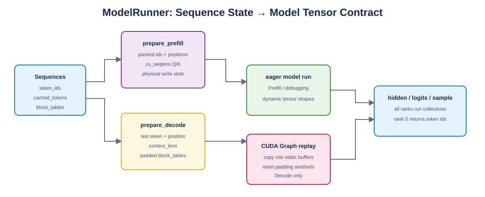

# Mini vLLM 教程：Day 11

> 对应 [Mini vLLM 复现手册](../MinivLLM复现手册.md) 的 Step 4。本章实现 ModelRunner 的张量准备、KV 容量预算、双进程共享内存消息和 CUDA Graph replay。



## 1. Prefill 张量契约

`prepare_prefill` 只打包未缓存 token，但 positions 使用真实绝对位置。若长度 6 的序列已有 4-token prefix cache，则输入是 token 4～5，position 是 `[4,5]`，`cu_seqlens_q` 增加 2，而 `cu_seqlens_k` 增加 6。

每个新 token 的物理写入位置统一由 `block_table[position//block_size]` 和 `position%block_size` 计算。

## 2. Decode 张量契约

每条序列只提供最后 token、当前位置、context length、当前物理 slot 和 padded block table。padding 使用 `-1`，kernel 必须结合 context length mask，不能访问哨兵地址。

## 3. KV Cache 容量

单个物理 block 字节数为：

```text
2 × layers × block_size × kv_heads × head_dim × dtype_bytes
```

其中 2 表示 K 和 V。可分配数量使用显存利用率预算扣除模型峰值和安全余量后向下取整。

## 4. 共享内存和 CUDA Graph

共享内存消息前 8 bytes 保存 payload 长度，payload 完整写入后才触发 Event。双进程测试验证整数请求与响应，测试结束会 close/unlink，不生成残留文件。

CUDA Graph 预分配固定 shape 的 ids、slots、lengths、tables；每次 replay 前先清零或填充 `-1`，再复制有效 batch，防止上一次较大 batch 的尾部数据污染当前执行。

## 5. 验证

```bash
python -m unittest day11.test_model_runner -v
```

6/6 通过：cached-prefix Prefill、Decode slot、非法 metadata、KV 字节公式、双进程共享内存、CUDA Graph 与 eager 对齐。

## 6. 本章完成标准

- [x] Prefill/Decode 元数据契约完整。
- [x] prefix cache positions 与 cu_seqlens 正确。
- [x] KV block 容量包含所有层以及 K/V 两份。
- [x] 共享内存包含明确长度并通过双进程往返。
- [x] CUDA Graph 静态 buffer 在 replay 前安全重置。

下一章实现 Scheduler 的 waiting/running 状态机、三类预算、抢占和停止条件。
