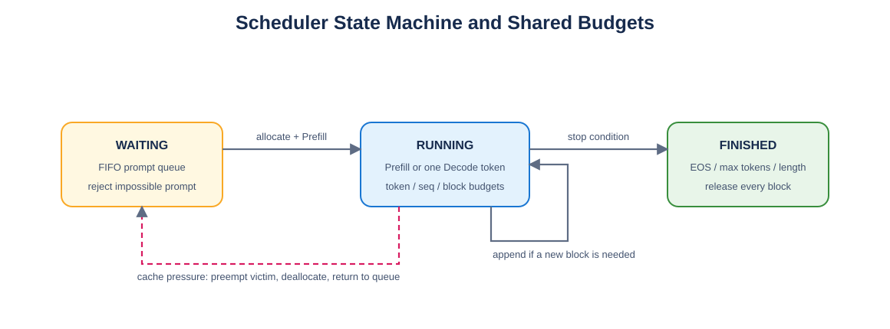

# Mini vLLM 教程：Day 12

> 对应 [Mini vLLM 复现手册](../MinivLLM复现手册.md) 的 Step 5。本章实现 waiting/running 调度、Prefill 优先、Decode、抢占和停止条件。



## 1. 三类共享预算

Scheduler 同时限制每轮 token 数、batch 中 sequence 数和物理 KV blocks。Prefill 的 token 成本是未缓存 token 数；Decode 每条序列成本为 1。

无法放入整个 KV 池、或 prompt 本身超过单轮 token 上限的请求在 `add_sequence` 时立即报错，不能永久留在 waiting 队列。

## 2. 调度顺序

1. 从 waiting 队首选择满足预算的 Prefill。
2. 本轮只要选到 Prefill，就返回 Prefill batch。
3. 没有 Prefill 时，从 running 中每条安排一个 Decode token。
4. 新 token 跨 block 且无空闲块时，抢占队尾低优先级序列。

被抢占序列释放所有 block、状态回到 WAITING，之后重新 Prefill；完整前缀仍可能通过 Day10 的缓存索引重新命中。

## 3. 停止条件

`postprocess` 追加采样 token 后检查 EOS、`max_tokens` 和 `max_model_length`。完成后立即将状态设为 FINISHED，从 running 移除并释放全部引用。

## 4. 验证

```bash
python -m unittest day12.test_scheduler -v
```

5/5 通过，覆盖 token/sequence 预算、永远无法容纳的 prompt、EOS、ignore EOS、max tokens、抢占和 block 泄漏检查。

## 5. 本章完成标准

- [x] Prefill 与 Decode 共用三类预算。
- [x] 不可执行请求立即失败。
- [x] 抢占后队列状态与引用计数正确。
- [x] 三种停止条件都会释放 cache。
- [x] 非终止状态下空调度会明确报错，不会死循环。

下一章用 LLMEngine 串联 tokenizer、Scheduler、ModelRunner、Qwen3、采样与输出解码。
