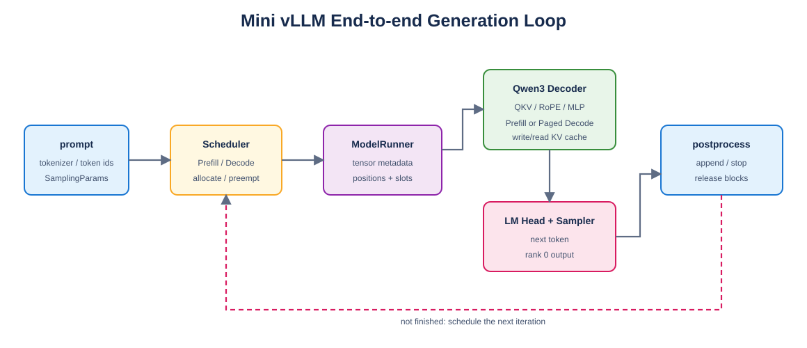

# Mini vLLM 教程：Day 13

> 对应 [Mini vLLM 复现手册](../MinivLLM复现手册.md) 的 Step 6。本章把 Qwen3、Paged KV Cache、ModelRunner、Scheduler、采样和输出串成可运行引擎。



## 1. 执行循环

[`engine.py`](engine.py) 中的固定顺序为：

```text
schedule
→ prepare_prefill / prepare_decode
→ Qwen3 forward
→ write/read paged KV cache
→ LM Head / sample
→ append token / stop / release
```

Prefill 每层将新 K/V 写入 Day5 定义的物理 slot；有 prefix cache 时，从 block table 收集历史 K/V，再执行 bottom-right causal Attention。Decode 只计算一个新 query，并由 Day7 PagedAttention 流式读取历史 cache。

## 2. API

`LLMEngine.generate_token_ids` 接收 token-id prompts；构造时传入 tokenizer 后，`generate` 也可直接接收字符串并解码输出。SamplingParams 控制 temperature、max tokens、EOS 和最大模型长度。

## 3. 正确性验证

```bash
python -m unittest day13.test_engine -v
python -m day13.distributed_model_check --processes 2
python -m day13.verify_engine_qwen3_06b
```

- 微型两层 Qwen3：CPU eager 和 CUDA Triton engine 生成 token 均与 Hugging Face 逐 token 一致。
- Prefix cache：后到请求正确命中 4 个 cached tokens。
- TP=2 CPU Gloo：完整 TP Qwen3 logits `allclose=True`，最大误差 `1.8e-7`，top-1 一致。
- 真实 Qwen3-0.6B：生成 `[358,2776]`，与 Hugging Face 完全一致；完成后 32 个 block 全部空闲。

## 4. 真实模型稳态性能

RTX 5060 Laptop GPU、float16、单请求、短 prompt、生成 2 tokens；先 warmup 以排除 Triton 首次编译，再运行 6 次：

| 路径 | 两 token 总时间 |
| --- | ---: |
| Hugging Face 每步全量重算 | 86.754 ± 19.755 ms |
| 当前 Paged 教学引擎 | 364.160 ± 50.592 ms |

当前引擎虽然避免 Decode 重算历史 K/V，但逐层 Python 编排、每层 metadata 校验和大量小 kernel 使短序列更慢。这个结果不是错误：它明确指出下一轮性能工作应是融合 QKV/Norm/RoPE、移除热路径 `.item()` 同步、批量化 metadata 校验，并把整段 Decode 捕获为 CUDA Graph，而不是只凭“使用了 PagedAttention”就宣称更快。

笔记本功耗状态和 WSL/DrvFS 状态会让绝对延迟明显波动，因此仓库保留可重复运行的脚本，以本机重新执行结果为准。

## 5. TP 验证边界

本机只有一张 GPU，因此 TP=2 使用双进程 CPU Gloo 验证真实 collective 与分片数学；CUDA Attention/Engine 则在单 GPU 验证。脚本未伪造双 GPU 性能数据。具备两张 GPU 时，可将相同结构切换到 NCCL 做最终性能验收。

## 6. 完成标准

- [x] Scheduler 驱动 Prefill 与 Decode 循环。
- [x] 每层 K/V 按物理 slot 写入并按 block table 读取。
- [x] prefix cache 对 Attention 与 positions 都生效。
- [x] CPU/CUDA 生成 token 与 Hugging Face 对齐。
- [x] TP=2 完整模型 logits 与 Hugging Face 对齐。
- [x] 真实 Qwen3-0.6B 端到端运行并释放全部 block。
- [x] 报告稳态性能及当前瓶颈，不包含首次编译时间。
