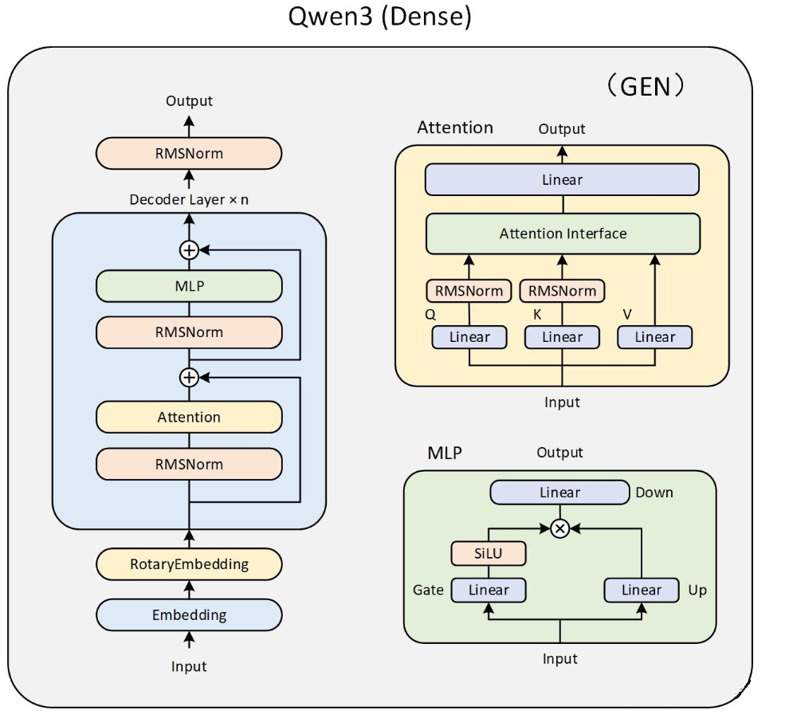
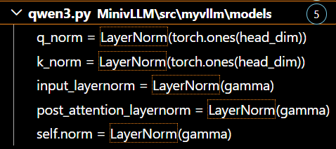
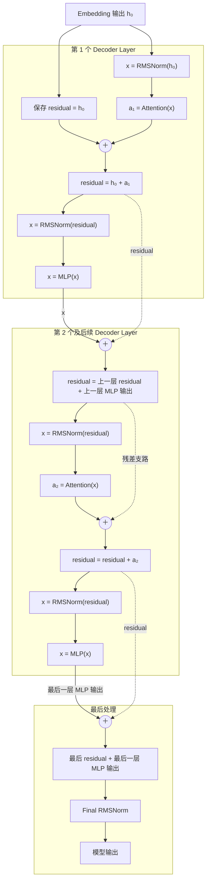
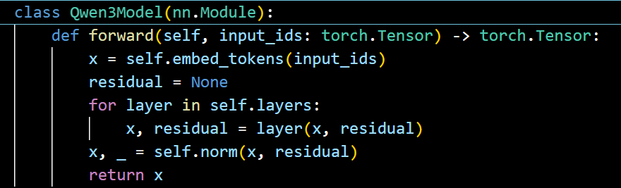
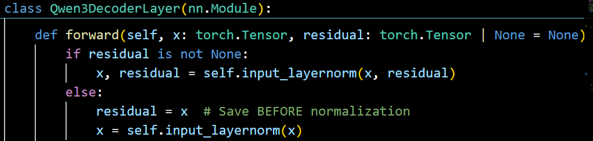

# Mini vLLM 教程：Day 2

## 1. 了解 RMSNorm

假设输入是一个 $2\times2$ 矩阵，每一行表示一个 token 的隐藏向量：

$$
X=
\begin{bmatrix}
1 & 2\\
3 & 4
\end{bmatrix}
$$

RMSNorm 对每一行分别计算，公式为：

$$
y_i=
\frac{x_i}{\sqrt{\frac{1}{H}\sum_{j=1}^{H}x_j^2+\epsilon}}
\gamma_i
$$

这里 $H=2$。先令可学习权重 $\gamma=[1,1]$，并为方便计算暂时忽略很小的 $\epsilon$。

### 1.1 每个元素平方

$$
X^2=
\begin{bmatrix}
1 & 4\\
9 & 16
\end{bmatrix}
$$

### 1.2 沿最后一维求平均，再开根号

$$
\mathrm{RMS}=
\begin{bmatrix}
\sqrt{(1+4)/2}\\
\sqrt{(9+16)/2}
\end{bmatrix}
=
\begin{bmatrix}
1.5811\\
3.5355
\end{bmatrix}
$$

### 1.3 每一行除以自己的 RMS

$$
Y=
\begin{bmatrix}
1/1.5811 & 2/1.5811\\
3/3.5355 & 4/3.5355
\end{bmatrix}
\approx
\begin{bmatrix}
0.6325 & 1.2649\\
0.8485 & 1.1314
\end{bmatrix}
$$

输出仍然是 $2\times2$ 矩阵。RMSNorm 调整每一行的数值尺度，但不减去均值，因此结果不一定以 0 为中心。

如果 $\gamma=[2,0.5]$，再按列进行逐元素缩放：

$$
Y\odot\gamma\approx
\begin{bmatrix}
1.2649 & 0.6325\\
1.6971 & 0.5657
\end{bmatrix}
$$

对应的 PyTorch 代码如下：

```python
import torch

x = torch.tensor([
    [1.0, 2.0],
    [3.0, 4.0],
])
gamma = torch.tensor([2.0, 0.5])
eps = 1e-6

# 在最后一维上计算每一行的平方均值和 RMS。
mean_square = x.pow(2).mean(dim=-1, keepdim=True)
rms = torch.sqrt(mean_square + eps)

# 除以 RMS 后，再乘可学习权重 gamma。
y = (x / rms) * gamma
print(y)
```

输出约为：

```text
tensor([[1.2649, 0.6325],
        [1.6971, 0.5657]])
```

## 2. 实现 RMSNorm

这里把 Decoder 内部的模块放在 `./layers` 目录下。首先回顾 Qwen3 的模型架构：



RMSNorm 主要分布在三个区域，共五处：Attention 内的 `q_norm` 和 `k_norm`、Decoder Layer 内的 `input_layernorm` 和 `post_attention_layernorm`，以及模型输出前的 `norm`。

如果已经下载完整的 Mini vLLM 项目代码，可以像下面这样查看 RMSNorm 在模型中的调用位置：



从图中可以看到，创建 `LayerNorm` 模块时主要传入参数 $\gamma$；$\epsilon$ 使用默认值。代码将 $\gamma$ 注册为可学习参数，而不是固定的超参数。

```python
class LayerNorm(torch.nn.Module):
    def __init__(self, gamma: torch.Tensor, eps: float = 1e-5):
        super().__init__()
        # Use nn.Parameter to make gamma learnable and loadable from checkpoints
        self.weight = torch.nn.Parameter(gamma.detach().clone())
        self.eps = eps

    @property
    def gamma(self):
        """Backward compatibility: gamma alias for weight"""
        return self.weight

    @torch.compile
    def rms_forward(self, x: torch.Tensor) -> torch.Tensor:
        # RMSNorm(x) = (x / sqrt(mean(x²) + ε)) ⊙ γ

        mean_square = x.pow(2).mean(dim=-1, keepdim=True)
        rms = (mean_square + self.eps).sqrt()
        return x / rms * self.weight
```

上面是 RMSNorm 的基础实现。在 Decoder Layer 中，旁路输入还会与子层输出逐元素相加，这就是残差连接。因此，同一个 RMSNorm 模块提供不带残差和带残差两条执行路径：

```python
def residual_rms_forward(
    self, x: torch.Tensor, residual: torch.Tensor
) -> tuple[torch.Tensor, torch.Tensor]:
    x = x + residual
    return self.rms_forward(x), x

def forward(
    self, x: torch.Tensor, residual: torch.Tensor | None = None
) -> torch.Tensor | tuple[torch.Tensor, torch.Tensor]:
    if residual is not None:
        return self.residual_rms_forward(x, residual)
    return self.rms_forward(x)
```

- 第一个 Decoder 的 `residual=None`，所以先执行 `residual=x`，保存 Embedding 输出。
- 第一个 Decoder 仍然有完整的 Attention 和 MLP 残差连接。
- 上一层的 MLP 输出会在下一层的 `input_layernorm(x, residual)` 中与残差相加。
- 最后一层的 MLP 输出没有下一层接收，因此由 `self.norm(x, residual)` 完成最后一次残差相加和 RMSNorm。



在 `qwen3.py` 的下面两处代码中，第一次传入的 `residual=None`，之后每次都会传入残差：




