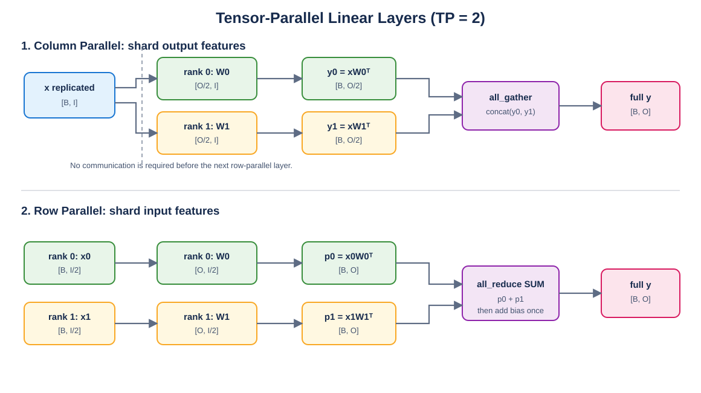

# Mini vLLM 教程：Day 3

> 对应 [Mini vLLM 复现手册](../MinivLLM复现手册.md) 的 Step 1.3：支持张量并行的线性层。本章先理解矩阵如何切分，再实现 checkpoint 分片加载，最后验证 Column、Row、Merged 和 QKV 四种 Linear。

## 教程环境

- Linux/WSL
- Python 3.10.19
- PyTorch 2.10.0+cu128
- 单张 RTX 5060 Laptop GPU；双 rank collective 使用 CPU Gloo 验证

## 前置知识

- 理解 `torch.nn.functional.linear(x, weight, bias)`。
- 知道 PyTorch Linear 权重 shape 是 `[out_features, in_features]`。
- 了解 rank、world size、`all_gather` 和 `all_reduce` 的基本含义。

## 1. 为什么模型需要张量并行

一个普通线性层为：

$$
Y=XW^T+b
$$

其中：

```text
X: [batch, input_size]
W: [output_size, input_size]
b: [output_size]
Y: [batch, output_size]
```

大模型的一张权重矩阵可能无法放进单张 GPU。Tensor Parallel 把同一层权重切到多张 GPU，每个 rank 只保存和计算自己的分片。



Draw.io 可编辑源文件：[tensor_parallel_linear.drawio](figures/tensor_parallel_linear.drawio)。

## 2. ColumnParallelLinear

Column Parallel 沿输出特征切分。注意：PyTorch 权重保存为 `[output,input]`，所以代码实际沿权重的第 0 维切分。

假设 `input_size=4`、`output_size=6`、`tp_size=2`：

```text
完整 W: [6, 4]
rank 0 W0: [3, 4]
rank 1 W1: [3, 4]

完整 X 会复制到两个 rank：X [batch, 4]
rank 0 输出 y0: [batch, 3]
rank 1 输出 y1: [batch, 3]
```

本地前向不需要通信：

```python
def forward(self, x):
    return F.linear(x, self.weight, self.bias)
```

只有调用者需要完整输出时才执行：

```python
y_full = torch.cat(all_gather(y_local), dim=-1)
```

在 Transformer 中，Column Parallel 后面通常直接接激活函数和 Row Parallel，因此中间结果可以一直保持分片，不必立即 `all_gather`。

## 3. checkpoint 的 weight_loader

Hugging Face checkpoint 保存的是完整权重，而当前 rank 的 Parameter 只有一个分片。不能直接 `param.copy_(loaded_weight)`。

```python
shard_size = full_output_size // tp_size
start = tp_rank * shard_size
shard = loaded_weight.narrow(0, start, shard_size)
param.copy_(shard)
```

本章把 loader 绑定到 Parameter：

```python
self.weight.weight_loader = self.weight_loader
```

以后统一权重加载器可以这样调用：

```python
if hasattr(param, "weight_loader"):
    param.weight_loader(param, checkpoint_tensor)
else:
    param.data.copy_(checkpoint_tensor)
```

这使 checkpoint 加载逻辑不需要知道每个层如何分片。

## 4. RowParallelLinear

Row Parallel 沿输入特征切分，对应权重第 1 维：

```text
完整 X: [batch, 8] -> x0/x1: [batch, 4]
完整 W: [6, 8]     -> W0/W1: [6, 4]

p0 = x0 @ W0.T -> [batch, 6]
p1 = x1 @ W1.T -> [batch, 6]
y  = p0 + p1 + bias
```

每个 rank 得到的是同一个输出的部分和，所以必须执行 `all_reduce(SUM)`：

```python
output = F.linear(x_local, self.weight, None)
dist.all_reduce(output, op=dist.ReduceOp.SUM)
output = output + self.bias
```

### bias 为什么只能加一次

错误写法是在每个 rank 先计算 `F.linear(..., bias)`，然后 all-reduce：

```text
(p0 + b) + (p1 + b) = p0 + p1 + 2b
```

正确做法是先对无 bias 的部分和执行 all-reduce，再加一次完整 bias。参考源码测试中使用 `bias/tp_size` 也能得到正确总和，但“reduce 后加一次”更直接，也不会因为 TP 数改变 checkpoint 中的 bias。

## 5. MergedColumnParallelLinear

Qwen3 MLP 有 `gate_proj` 和 `up_proj`：

```text
gate = gate_proj(x)
up   = up_proj(x)
output = SiLU(gate) * up
```

为了用一次矩阵乘法完成两个投影，运行时把本地权重排成：

```text
rank 0 parameter = [gate_rank0 | up_rank0]
rank 1 parameter = [gate_rank1 | up_rank1]
```

checkpoint 仍是两个独立参数，所以 loader 还要接收 `loaded_weight_id`：

```python
layer.weight_loader(layer.weight, gate_weight, 0)
layer.weight_loader(layer.weight, up_weight, 1)
```

需要同时计算：

- checkpoint 中当前 rank 的 source offset；
- 合并 Parameter 中当前投影的 target offset。

只切 checkpoint、不切目标 Parameter，会让 gate/up 覆盖彼此。

## 6. QKVColumnParallelLinear

Attention 将 Q、K、V 三个投影合并为一次 Linear，但 GQA 中 Q head 数量与 KV head 数量不同。

以 `head_size=128`、`num_heads=16`、`num_kv_heads=8`、`tp_size=2` 为例：

```text
每个 rank:
Q heads  = 16 / 2 = 8
KV heads =  8 / 2 = 4

local output size = 128 * (8 + 4 + 4)
local layout      = [Q_local | K_local | V_local]
```

不能沿 `head_size` 内部继续切分，否则单个 rank 无法独立计算一个完整 attention head。必须检查 Q/KV head 数都能被 TP size 整除。

## 7. Column → Row 为什么配合得好

MLP 的常见数据流：

```text
复制的 hidden states
 -> ColumnParallel(gate/up)
 -> 每个 rank 的本地 SiluAndMul
 -> RowParallel(down projection)
 -> all_reduce
 -> 每个 rank 都得到完整 hidden states
```

Column 的输出切分维正好是 Row 的输入切分维，因此两层之间不需要通信。只在 Row 的末尾进行一次 all-reduce。

## 8. 代码结构

实现位于 [`layers/linear.py`](layers/linear.py)：

```text
LinearBase
├── ReplicatedLinear
├── ColumnParallelLinear
│   ├── MergedColumnParallelLinear
│   └── QKVColumnParallelLinear
└── RowParallelLinear
```

教学实现允许显式传入 `tp_rank/tp_size`，这样只有一张 GPU 时也能创建两个“虚拟 rank”验证切片。真实运行时不传参数，类会从已经初始化的 `torch.distributed` process group 读取 rank 和 world size。

## 9. 单元测试与演示

在 WSL 中执行：

```bash
cd /mnt/d/githubproject/vllm_from_0_to_1
source ~/miniconda3/etc/profile.d/conda.sh
conda activate cuda129_py310

python -m unittest day3.test_linear -v
python -m day3.demo_linear
```

7 个单元测试已通过，其中包含单 rank CUDA 数值对齐。演示输出：

```text
full output shape   = (2, 6)
column local shapes = [(2, 3), (2, 3)]
column allclose     = True
row partial shapes  = [(2, 6), (2, 6)]
row allclose        = True
```

## 10. 真实 collective 验证

本机单 GPU 可以启动两个 CPU rank，用 Gloo 真正执行 `all_gather/all_reduce`：

```bash
python -m day3.distributed_check --spawn-cpu 2
```

实测结果：

```text
[ColumnParallel] allclose=True, max_abs_err=0.000000
[MergedColumnParallel] allclose=True, max_abs_err=0.000000
[QKVColumnParallel] allclose=True, max_abs_err=0.000000
[RowParallel] allclose=True, max_abs_err=0.000001
```

有两张及以上 GPU 时执行 NCCL 版本：

```bash
torchrun --standalone --nproc_per_node=2 -m day3.distributed_check
```

`--nproc_per_node` 不能超过可用 GPU 数。单张 GPU 不要强行启动两个 NCCL rank。

## 11. 常见错误

- 忘记 PyTorch 权重 shape 是 `[out,input]`，切错维度。
- output/input size 不能整除 TP size，却直接向下取整。
- Column 输出顺序按 rank 拼接错误。
- Merged/QKV `all_gather` 后直接拼 local tensor，得到 `[Q0,K0,V0,Q1,K1,V1]`，而 checkpoint 逻辑顺序应为 `[Q0,Q1,K0,K1,V0,V1]`。
- Row Parallel 在 all-reduce 前每个 rank 都加完整 bias，导致 bias 被乘以 TP size。
- Q/K/V 的 loader 使用同一个 shard size，忽略 GQA 中 Q heads 与 KV heads 不同。
- `tp_size>1` 但 process group 未初始化就调用 Row `forward`。

## 12. 本章完成标准

- [x] ReplicatedLinear 与 `F.linear` 对齐。
- [x] ColumnParallel 能正确切分并重建完整输出。
- [x] RowParallel 能正确求和，并且 bias 只加一次。
- [x] Merged gate/up 能加载到正确本地位置。
- [x] QKV 支持 GQA 的不同 Q/KV head 数。
- [x] 7 个单元测试通过（包含 CUDA）。
- [x] 双进程 Gloo collective 四项全部 `allclose=True`。

下一章实现 VocabParallelEmbedding、ParallelLMHead 和 Sampler，继续沿词表维度进行张量并行。
