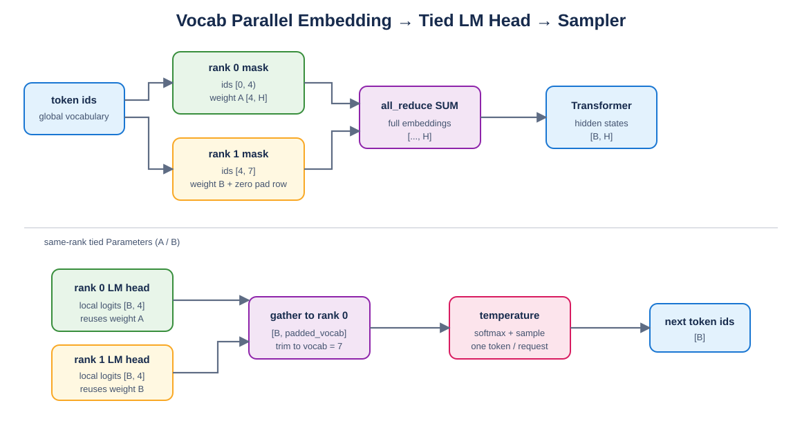

# Mini vLLM 教程：Day 4

> 对应 [Mini vLLM 复现手册](../MinivLLM复现手册.md) 的 Step 1.4。本章实现 `VocabParallelEmbedding → ParallelLMHead → Sampler`，并验证非整除词表、权重绑定、Prefill 最后 token 和分布式通信。

## 教程环境

- Linux/WSL，Python 3.10.19
- PyTorch 2.10.0+cu128，CUDA Runtime 12.8
- RTX 5060 Laptop GPU 8 GB
- 双 rank collective 使用 CPU Gloo 验证

## 1. 为什么沿词表切分

Embedding 权重 shape 为：

```text
[vocab_size, hidden_size]
```

LM Head 使用同一个 shape，只是计算方向相反：

```text
Embedding: token id -> weight[token_id] -> hidden vector
LM Head:   hidden @ weight.T -> vocabulary logits
```

沿 vocabulary rows 切分后，每个 rank 只保存一段 token 的向量，同时可以让 Embedding 与 LM Head 共享同一份本地 Parameter。



Draw.io 可编辑源文件：[vocab_parallel.drawio](figures/vocab_parallel.drawio)。

## 2. 词表不能整除 TP size

假设 `vocab_size=7`、`tp_size=2`：

```text
padded_vocab_size = ceil(7 / 2) * 2 = 8
partition_size    = 8 / 2 = 4

rank 0: global ids [0, 4) -> 0,1,2,3
rank 1: global ids [4, 8) -> 4,5,6 + padding row
```

最后一个 padding row 不属于真实词表，权重加载时必须清零；LM Head 聚合后把 logits 从 8 裁回 7。

## 3. VocabParallelEmbedding

实现位于 [`layers/embedding_head.py`](layers/embedding_head.py)。每个 rank 先判断 token 是否属于自己的词表区间：

```python
mask = (input_ids >= vocab_start) & (input_ids < vocab_end)
local_ids = (input_ids - vocab_start).masked_fill(~mask, 0)
output = F.embedding(local_ids, local_weight)
output = output * mask.unsqueeze(-1)
```

无效位置临时映射到本地 row 0，是为了让 `F.embedding` 地址合法；查表后必须再次乘 mask，否则其他 rank 的 row 0 会污染结果。

`mask.unsqueeze(-1)` 可同时支持 `[tokens]`、`[batch,seq]` 等输入。写成固定的 `unsqueeze(1)` 只对一维 token 列表成立。

最后：

```python
dist.all_reduce(output, op=dist.ReduceOp.SUM)
```

每个 token 只有所属 rank 的输出非零，所以求和后所有 rank 都得到完整 embedding。

## 4. 权重加载

checkpoint 中是未 padding 的 `[7,H]`：

```python
actual_start = min(vocab_start, vocab_size)
actual_end = min(vocab_end, vocab_size)
actual_size = actual_end - actual_start

local_weight[:actual_size] = full_weight[actual_start:actual_end]
local_weight[actual_size:] = 0
```

本章会校验完整 checkpoint shape，避免错误模型的词表权重被静默切片。

## 5. ParallelLMHead

本地计算无需转置权重代码：

```python
local_logits = F.linear(hidden_states, local_weight)
```

`F.linear` 内部已经执行 `hidden @ weight.T`。每个 rank 得到 `[batch, vocab_partition]`，rank 0 汇总：

```python
dist.gather(local_logits, gather_list=parts, dst=0)
full_logits = torch.cat(parts, dim=-1)[..., :vocab_size]
```

### gather 与 all_gather

- `gather`：只有 `dst` 收到所有分片，更适合仅 rank 0 采样。
- `all_gather`：每个 rank 都收到所有分片，使用更多通信与显存。

worker rank 仍必须调用 `gather` 参与 collective，只是不需要构造 `gather_list`。

## 6. Prefill 为什么只取最后位置

Packed Prefill hidden states 包含所有新 token，但每条请求只从最后一个 query 预测下一个 token：

```text
cu_seqlens_q = [0, 2, 5]
last_indices = [2, 5] - 1 = [1, 4]
```

```python
hidden_for_logits = hidden_states.index_select(0, last_indices).contiguous()
```

`index_select` 后调用 `contiguous()`，让 LM Head 接收连续内存。Decode 每条序列本来只有一个 token，不需要这一步。

## 7. Tied Embeddings

权重绑定不是复制数值：

```python
lm_head.weight = embedding.weight
```

两个模块必须引用同一个 `nn.Parameter`。测试同时验证：

```python
lm_head.weight is embedding.weight
lm_head.weight.data_ptr() == embedding.weight.data_ptr()
```

如果只执行 `copy_`，会得到两份独立显存，既浪费内存，后续修改也不会同步。

## 8. Sampler

Temperature 控制分布平滑程度：

$$
p_i=\mathrm{softmax}(z_i/T)
$$

- $T<1$：更偏向高概率 token。
- $T>1$：分布更平坦。
- 本教程不允许 $T=0$，greedy 应单独实现 `argmax` 路径。

参考实现使用 exponential race 完成 multinomial sampling：

```python
probs = softmax(logits / temperature)
noise = EmptyLike(probs).exponential_(1)
token = (probs / noise).argmax(dim=-1)
```

代码使用 `scaled_logits = ...`，不原地执行 `logits /= temperature`，因为 logits 可能还要用于调试、计算 logprob 或与参考模型对齐。

## 9. 运行验证

```bash
cd /mnt/d/githubproject/vllm_from_0_to_1
source ~/miniconda3/etc/profile.d/conda.sh
conda activate cuda129_py310

python -m unittest day4.test_embedding_head -v
python -m day4.demo_embedding_head
python -m day4.distributed_check --processes 2
```

演示输出：

```text
padded vocab size   = 8
local weight shapes = [(4, 4), (4, 4)]
embedding allclose  = True
LM head allclose    = True
sampled token ids   = [6, 6]
```

双进程 Gloo 输出：

```text
[VocabParallelEmbedding] allclose=True
[ParallelLMHead] allclose=True
[TiedWeight] same_parameter=True
```

## 10. 常见错误

- 沿 hidden size 切 Embedding，而不是沿 vocabulary rows。
- 非本 rank 的 token 映射到 row 0 后，忘记把查表结果重新 mask 为 0。
- 词表不能整除 TP size 时既不 padding，也不限制最后一片大小。
- gather 后忘记裁掉 padded vocabulary logits。
- worker rank 没有进入 collective，rank 0 永久等待。
- 把 `gather` 和 `all_gather` 的参数形式混用。
- tied embedding 使用 `copy_`，并没有共享 Parameter。
- Prefill 对每个 prompt 的全部 token 都采样，而不是只取最后 query。
- Sampler 原地修改 logits。

## 11. 本章完成标准

- [x] 非整除词表能够 padding、加载和裁剪。
- [x] 虚拟双 rank Embedding/LM Head 与 PyTorch 对齐。
- [x] Prefill 最后 query 索引正确。
- [x] Embedding 与 LM Head 共享同一个 Parameter。
- [x] Sampler 不修改输入 logits。
- [x] 双进程 Gloo all-reduce/gather 通过。
- [x] CPU 与 CUDA 路径测试通过。

下一章进入 Attention 的第一部分：确定 KV Cache 内存布局，并把新 K/V 按随机 `slot_mapping` 写入物理 block。
