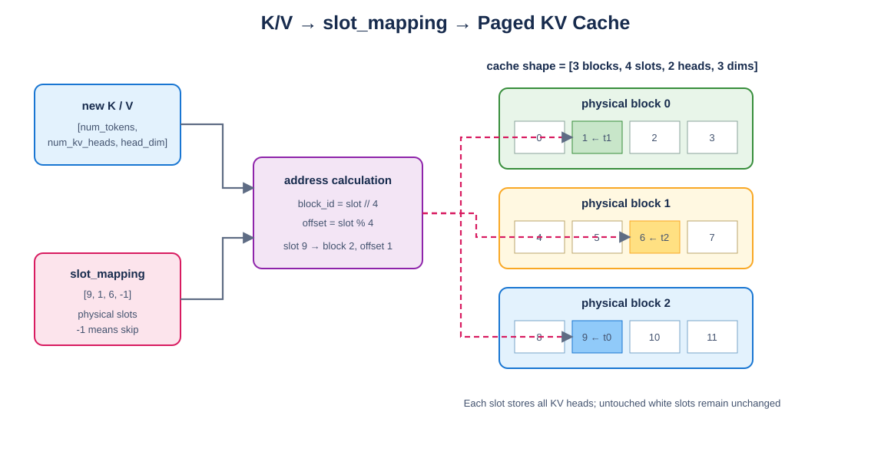

# Mini vLLM 教程：Day 5

> 对应 [Mini vLLM 复现手册](../MinivLLM复现手册.md) 的 Step 1.5.2～1.5.3。本章只完成 KV Cache 的布局和写入，Prefill/Decode Attention 分别留到 Day6、Day7。

## 教程环境

- Linux/WSL，Python 3.10.19
- PyTorch 2.10.0+cu128，CUDA Runtime 12.8
- RTX 5060 Laptop GPU 8 GB
- Triton CUDA kernel 与纯 PyTorch 参考实现对齐

## 1. 为什么需要 Paged KV Cache

自回归生成每次只新增一个 token，但 Attention 仍要读取此前所有 token 的 K/V。若每条请求各自申请一块连续显存，长度不同会造成碎片，也不便于动态扩容。

Paged KV Cache 把显存池切成固定大小的物理 block。序列只记录逻辑 block 到物理 block 的映射；写入时，本轮 token 通过 `slot_mapping` 直接定位到物理 slot。



Draw.io 可编辑源文件：[kv_cache_write.drawio](figures/kv_cache_write.drawio)。

## 2. Cache 布局

本教程采用：

```text
[num_blocks, block_size, num_kv_heads, head_dim]
```

例如 cache shape 为 `[3,4,2,3]`：共有 3 个物理 block，每个 block 有 4 个 token slot，每个 slot 保存 2 个 KV head，每个 head 的维度为 3。

物理 slot 与二维 block 地址的关系：

```python
block_id = slot // block_size
block_offset = slot % block_size
```

扁平元素偏移为：

$$
((block\_id \times block\_size + block\_offset) \times num\_kv\_heads + kv\_head) \times head\_dim + d
$$

注意：`slot_mapping` 保存的是物理 slot，不是该 token 在序列里的位置。

## 3. PyTorch 参考实现

实现位于 [`layers/kv_cache.py`](layers/kv_cache.py)。先把 cache 前两维视为连续物理 slot：

```python
flat_cache = cache.view(num_blocks * block_size, num_kv_heads, head_dim)
valid = slot_mapping >= 0
flat_cache[slot_mapping[valid]] = key[valid]
```

`slot_mapping=-1` 表示跳过该 token，不应写入任何 cache 位置。参考实现的作用不是追求最快，而是给 Triton kernel 提供容易核对的正确答案。

## 4. Triton kernel 如何划分工作

kernel grid 为：

```text
(num_tokens, num_kv_heads)
```

每个 Triton program 负责一个 token 的一个 KV head，并在最后一维上并行搬运 `head_dim` 个元素。`head_dim` 不一定是 2 的幂，因此实际 block 使用：

```python
block_d = triton.next_power_of_2(head_dim)
mask = offsets_d < head_dim
```

这样像测试中的 `head_dim=6` 也不会越界。

## 5. 为什么地址使用 int64

cache 较大时，下面乘积可能超过 32 位整数范围：

```text
block_id * block_size * num_kv_heads * head_dim
```

本实现要求 `slot_mapping.dtype == torch.long`，kernel 也显式转为 `tl.int64` 后再计算地址，避免大 cache 下偏移溢出。

## 6. 为什么禁止重复 slot

同一次 kernel 启动中，两个 token 若写入相同 slot，会发生并行写竞争，最终内容不确定。正常调度器不应生成重复的可写 slot，因此本章在入口处直接报错，而不是静默接受错误元数据。

## 7. 安全处理 `-1`

跳过的 token 仍会启动 program。kernel 先把无效 slot 临时替换成合法地址 0，再用 mask 禁止 load/store：

```python
writable = slot >= 0
safe_slot = tl.where(writable, slot, 0)
mask = writable & (offsets_d < head_dim)
```

这样无效 lane 不会参与负地址计算。

## 8. 运行验证

```bash
cd /mnt/d/githubproject/vllm_from_0_to_1
source ~/miniconda3/etc/profile.d/conda.sh
conda activate cuda129_py310

python -m unittest day5.test_kv_cache -v
python -m day5.demo_kv_cache
```

测试结果：

```text
Ran 6 tests
OK
```

演示输出：

```text
device          = cuda
cache shape     = (3, 4, 2, 3)
slot mapping    = [9, 1, 6, -1]
token 0 -> block 2, offset 1, correct=True
token 1 -> block 0, offset 1, correct=True
token 2 -> block 1, offset 2, correct=True
written slots   = [1, 6, 9]
```

## 9. 常见错误

- 把序列内 token 下标直接当成物理 slot。
- 只用 `[0,1,2,...]` 测试，导致 block/offset 算反也不易暴露。
- cache shape 中使用 query head 数，而不是 KV head 数。
- `slot=-1` 时仍计算并访问负地址。
- `head_dim` 非 2 的幂时忘记 mask。
- K/V 的 dtype、device 或 shape 不一致。
- 两个 token 同时写入同一个 slot，产生数据竞争。
- 只验证写入位置，没有检查未写位置是否被污染。

## 10. 本章完成标准

- [x] 明确 `[blocks, block_size, kv_heads, head_dim]` 布局。
- [x] 纯 PyTorch reference 支持随机非连续 slot。
- [x] `-1` 跳过写入，未写位置保持不变。
- [x] Triton 支持非 2 的幂 `head_dim`。
- [x] CUDA Triton 输出与 PyTorch reference 对齐。
- [x] 非法地址、重复 slot、shape/dtype/device 均有入口检查。

下一章实现 packed 变长 Prefill Attention，并与逐序列的朴素 PyTorch causal attention 对齐。
