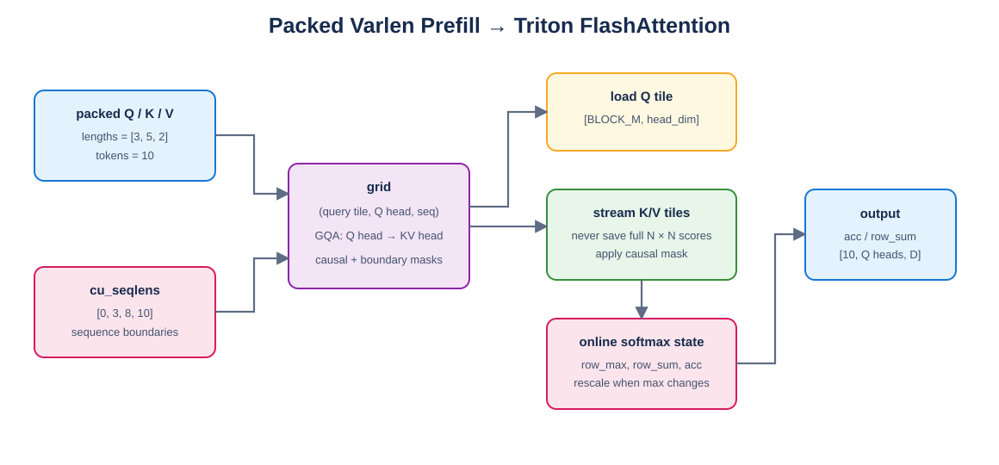

# Mini vLLM 教程：Day 6

> 对应 [Mini vLLM 复现手册](../MinivLLM复现手册.md) 的 Step 1.5.4。本章实现 packed 变长 Prefill FlashAttention，不提前混入 Decode PagedAttention。

## 教程环境

- Linux/WSL，Python 3.10.19
- PyTorch 2.10.0+cu128，CUDA Runtime 12.8
- RTX 5060 Laptop GPU 8 GB
- Qwen3-0.6B Attention 参数：16 个 Q head、8 个 KV head、`head_dim=128`

## 1. Packed 变长输入

多个 prompt 不需要 padding 到相同长度，可以直接拼成一个 token 维度：

```text
lengths     = [3, 5, 2]
cu_seqlens = [0, 3, 8, 10]
```

第 `i` 条序列范围为 `[cu_seqlens[i], cu_seqlens[i+1])`。kernel grid 增加 sequence 维度，任何 Q/K 访问都要加对应的 `seq_start`，防止不同请求互相 Attention。



Draw.io 源文件：[prefill_flash_attention.drawio](figures/prefill_flash_attention.drawio)。

## 2. 朴素参考实现

[`layers/prefill_attention.py`](layers/prefill_attention.py) 保留 `prefill_attention_reference`：逐序列构造 $QK^T$、执行 causal mask、softmax，再乘 V。它会产生 $N\times N$ 分数矩阵，但逻辑直观，适合作为正确性基线。

GQA 中多个 Q head 共享一个 KV head：

```python
queries_per_kv = num_q_heads // num_kv_heads
kv_head = q_head // queries_per_kv
```

## 3. Triton FlashAttention

Triton kernel 的 grid 是：

```text
(query_block, q_head, sequence)
```

每个 program 常驻一个 Q tile，依次流式读取 K/V tile，不保存完整分数矩阵。online softmax 保存三个状态：当前行最大值 `row_max`、归一化分母 `row_sum`、加权 V 累加值 `acc`。

当新 tile 出现更大的分数时：

$$
\alpha=\exp(m_{old}-m_{new})
$$

旧状态必须同时缩放：

```text
acc     = alpha * acc + P @ V
row_sum = alpha * row_sum + sum(P)
```

只缩放 `row_sum` 而不缩放 `acc` 会得到错误结果。

## 4. Causal、变长与 GQA

有效分数必须同时满足：

```text
query 在本序列内
key 在本序列内
key_position <= query_position
```

Q head 到 KV head 的映射在 kernel 内完成，不需要真实复制 K/V。当前 Triton 教学 kernel 处理普通 Prefill，即每条序列 Q/K 长度相同；存在已缓存 prefix、导致 K 比 Q 长时，入口使用 SDPA 正确性路径，并采用 bottom-right causal 对齐。

## 5. 验证

```bash
cd /mnt/d/githubproject/vllm_from_0_to_1
source ~/miniconda3/etc/profile.d/conda.sh
conda activate cuda129_py310

python -m unittest day6.test_prefill_attention -v
python -m day6.benchmark_prefill
```

6 项测试全部通过，覆盖 packed 变长、序列隔离、causal、GQA、prefix 和 CUDA Triton 对齐。

## 6. 实机六次基准

每项先 warmup 3 次，再计时 6 次；单位为 ms，输入为 float16：

| 序列长度 | 朴素 PyTorch | Triton FlashAttention |
| --- | ---: | ---: |
| `[128]` | 0.783 ± 0.013 | 0.544 ± 0.026 |
| `[256]` | 0.964 ± 0.135 | 0.635 ± 0.050 |
| `[128,384]` | 1.287 ± 0.044 | 0.596 ± 0.166 |

结果只代表当前 RTX 5060 Laptop GPU、驱动和软件环境；短序列下 Python 调度、kernel 启动和缓存状态会明显影响时间。

## 7. 常见错误

- 忘记用 `cu_seqlens` 隔离请求。
- causal mask 写反，允许当前 query 读取未来 token。
- GQA 直接按相同 head 下标读取 K/V。
- 最后一个不完整 tile 未做边界 mask。
- online softmax 最大值更新后只缩放分母，没有缩放 `acc`。
- 把 Prefill 的连续 K/V 读取与 Decode 的 block table 读取混为一套地址逻辑。

## 8. 本章完成标准

- [x] 朴素 PyTorch causal reference。
- [x] packed 变长序列互相隔离。
- [x] GQA head 映射正确。
- [x] Triton online-softmax kernel 不保存完整 attention matrix。
- [x] float16 CUDA 输出与 float32 累加 reference 对齐。
- [x] 使用 Qwen3-0.6B Attention 参数完成六次实机基准。

下一章从随机 `block_table` 读取 Day5 写入的物理 KV Cache，实现单 token Decode PagedAttention。
