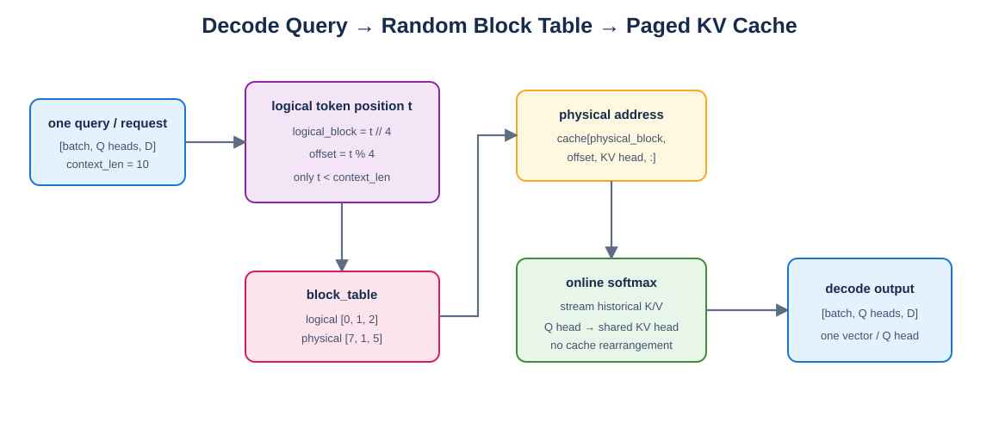

# Mini vLLM 教程：Day 7

> 对应 [Mini vLLM 复现手册](../MinivLLM复现手册.md) 的 Step 1.5.5。本章实现单 token Decode PagedAttention，读取 Day5 定义的物理 KV Cache。

## 教程环境

- Linux/WSL，Python 3.10.19
- PyTorch 2.10.0+cu128，CUDA Runtime 12.8
- RTX 5060 Laptop GPU 8 GB
- Qwen3-0.6B 参数：16 Q heads、8 KV heads、`head_dim=128`

## 1. Decode 与 Prefill 的差别

Decode 时每条请求只有一个新 query，却要读取全部历史 K/V。历史 cache 的物理 block 不保证连续，因此不能像 Day6 一样按 packed token 连续读取。



Draw.io 源文件：[decode_paged_attention.drawio](figures/decode_paged_attention.drawio)。

## 2. 两级地址映射

对历史 token 位置 `t`：

```python
logical_block = t // block_size
offset = t % block_size
physical_block = block_table[logical_block]
kv = cache[physical_block, offset, kv_head, :]
```

`block_table=[7,1,5]` 表示序列的前三个逻辑块实际存放在物理块 7、1、5。这里不能把 `logical_block` 直接作为 cache block id。

## 3. PyTorch reference

[`layers/paged_attention.py`](layers/paged_attention.py) 先根据每条请求的 `context_len` 生成历史位置，再批量索引 cache。它会明确收集完整 K/V，便于检查随机 block table 是否正确。

GQA 使用：

```python
kv_head = q_head // (num_q_heads // num_kv_heads)
```

## 4. Triton kernel

grid 为 `(batch, q_head)`。一个 program 持有一个 query head，以 token chunk 流式读取历史 cache，并用 online softmax 更新 `max`、`denom` 和 `acc`。

每个 lane 都单独执行逻辑块到物理块的转换，因此 chunk 可以跨越多个物理块，且 `BLOCK_N` 不需要等于 `block_size`。无效 lane 先映射到物理块 0，再由 mask 禁止读取，避免非法地址参与计算。

## 5. 验证与基准

```bash
cd /mnt/d/githubproject/vllm_from_0_to_1
source ~/miniconda3/etc/profile.d/conda.sh
conda activate cuda129_py310
python -m unittest day7.test_paged_attention -v
python -m day7.benchmark_decode
```

4 项测试全部通过，覆盖随机 block table、GQA、不完整末块和非法表项。

每项 warmup 3 次、计时 6 次，float16，`block_size=16`：

| Batch / Context | PyTorch reference | Triton PagedAttention |
| --- | ---: | ---: |
| 1 / 128 | 0.820 ± 0.227 ms | 0.345 ± 0.020 ms |
| 4 / 512 | 1.972 ± 0.204 ms | 0.843 ± 0.056 ms |
| 4 / 1024 | 2.146 ± 0.109 ms | 0.903 ± 0.074 ms |

## 6. 常见错误

- 使用顺序 block table 做唯一测试。
- 把逻辑 block id 当成物理 block id。
- cache 地址中使用全局 token 位置，而不是 block 内 offset。
- 最后一个 block 不满时仍读取多余 slot。
- GQA 的每个 Q head 读取同编号 KV head。
- masked lane 仍用 `-1` 参与指针运算。
- 地址乘积使用 32 位整数导致大 cache 溢出。

## 7. 本章完成标准

- [x] 随机非连续 block table 与 reference 对齐。
- [x] GQA head 映射正确。
- [x] 支持不同 context length 和不完整末块。
- [x] Triton 使用 online softmax，不重排物理 cache。
- [x] 使用 Qwen3-0.6B 参数完成六次实机基准。

下一章实现 Qwen3 使用的 RoPE，以及 Attention 内部 Q/K 的 RMSNorm。
