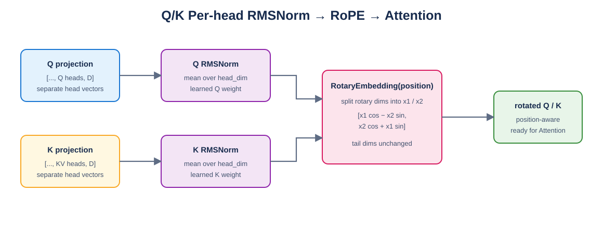

# Mini vLLM 教程：Day 8

> 对应 [Mini vLLM 复现手册](../MinivLLM复现手册.md) 的 Step 1.6。本章实现 Qwen3 Attention 中的 Q/K RMSNorm 和 RoPE。

## 1. 执行顺序

Qwen3 在 Q/K 投影并 reshape 成 head 后，先分别做每个 head 的 RMSNorm，再应用 RoPE：



Draw.io 源文件：[qk_norm_rope.drawio](figures/qk_norm_rope.drawio)。

这里的 Q/K RMSNorm 沿 `head_dim` 求均方，不是沿所有 heads 一起归一化；Q 和 K 也拥有不同的可学习 weight。

## 2. RoPE 计算

对偶数 `rotary_dim`，先将参与旋转的部分切成两半 `x1,x2`：

$$
x'_1=x_1\cos\theta-x_2\sin\theta
$$

$$
x'_2=x_2\cos\theta+x_1\sin\theta
$$

若 `rotary_dim < head_dim`，末尾维度保持不变。位置 0 的角度为 0，因此输出必须与输入完全相同。

## 3. 位置与 cache

[`layers/rotary_embedding.py`](layers/rotary_embedding.py) 初始化时预计算 float32 cos/sin cache，forward 按 `positions` 索引后转换为输入 dtype。支持：

- packed：`x=[total_tokens,heads,D]`，`positions=[total_tokens]`；
- batched：`x=[batch,seq,heads,D]`，`positions=[seq]` 或 `[batch,seq]`；
- Decode：每条请求传入当前 token 的真实绝对位置。

位置不能在每个 KV block 内从 0 重新计数；block table 只改变存储地址，不改变 RoPE 的逻辑位置。

## 4. 验证

```bash
cd /mnt/d/githubproject/vllm_from_0_to_1
source ~/miniconda3/etc/profile.d/conda.sh
conda activate cuda129_py310
python -m unittest day8.test_rotary_embedding -v
```

6 项测试全部通过，包括与 `transformers.models.qwen3` 的 `apply_rotary_pos_emb` 数值对齐、位置 0、packed/batched、partial rotary、Q/K RMSNorm 和 CUDA float16。

## 5. 常见错误

- 在投影 reshape 成 heads 之前做 Q/K RMSNorm。
- Q/K 共用一个 norm weight。
- cos/sin 的 token 维和 head 维广播位置写反。
- Decode 使用 block 内 offset 作为 RoPE position。
- partial rotary 时错误旋转整个 head_dim。
- cos/sin cache 留在 CPU 或强制输出为 float32。

## 6. 本章完成标准

- [x] Q/K 分别按 head_dim 执行 RMSNorm。
- [x] 支持 packed、batched 和 Decode positions。
- [x] 支持 partial rotary 并保留 tail。
- [x] dtype/device 保持正确。
- [x] 与 Hugging Face Qwen3 helper 对齐。

下一章将 Day1～Day8 的层组装成完整 Qwen3 Decoder，并实现 Hugging Face checkpoint 权重加载。
