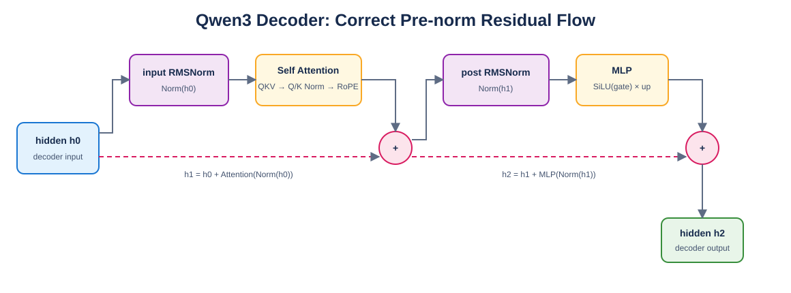

# Mini vLLM 教程：Day 9

> 对应 [Mini vLLM 复现手册](../MinivLLM复现手册.md) 的 Step 2。本章把前八天的基础层组装为 Qwen3，并实现 Hugging Face checkpoint 映射。

## 1. Decoder 数据流



Draw.io 可编辑源文件：[qwen3_decoder.drawio](figures/qwen3_decoder.drawio)。

正确数学关系为：

```text
h1 = h0 + Attention(RMSNorm(h0))
h2 = h1 + MLP(RMSNorm(h1))
```

两个 `+` 都是逐元素相加。推理框架可以延迟残差加法以融合 kernel，但不能改变这个关系。

## 2. Attention 与 MLP

[`modeling_qwen3.py`](modeling_qwen3.py) 的 Attention 顺序是：合并 QKV 投影、拆分并 reshape heads、Q/K RMSNorm、RoPE、causal attention、输出投影。

MLP 为：

```text
gate_up_proj(x).chunk(2)
→ SiLU(gate) * up
→ down_proj
```

## 3. checkpoint 映射

Hugging Face checkpoint 分别保存 `q_proj/k_proj/v_proj`，运行时合并为一个 `qkv_proj`；`gate_proj/up_proj` 同样合并为 `gate_up_proj`。加载器按固定顺序沿输出维拼接，并拒绝任何未映射 key，避免静默漏权重。

当 `tie_word_embeddings=True` 时，Embedding 和 LM Head 必须引用同一个 Parameter，而不是复制值。

## 4. 验证

```bash
python -m unittest day9.test_qwen3 -v
python -m day9.verify_qwen3_06b
```

微型两层随机 Qwen3 与 Hugging Face logits 严格对齐，4/4 测试通过。随后使用本机缓存的真实 `Qwen/Qwen3-0.6B` float16 checkpoint 验证：

```text
shape=(1, 5, 151936)
max_abs_error=0.031250
mean_abs_error=0.004515
allclose=True
top1_match=True
unmapped/ignored keys=[]
```

误差来自 float16 下合并投影与独立投影的矩阵乘执行顺序不同；最终 top-1 token 完全一致。

## 5. 常见错误

- 沿错误维度拼接 Q/K/V 或 gate/up 权重。
- 把 Q/K per-head Norm 权重当成 decoder hidden-size Norm。
- Qwen3-0.6B 的 `head_dim`、`rope_theta` 使用旧模型默认值。
- residual 保存的是归一化后张量。
- tied embedding 使用 `copy_`，产生两份参数。
- loader 忽略未识别 checkpoint key。

## 6. 本章完成标准

- [x] Attention、MLP、Decoder、Model、CausalLM 完整组装。
- [x] QKV 与 gate/up checkpoint 正确合并。
- [x] tied weight 共享同一个 Parameter。
- [x] 微型模型与 Hugging Face logits 对齐。
- [x] 真实 Qwen3-0.6B checkpoint 无漏载并对齐 logits/top-1。

下一章进入引擎层，实现 Sequence、Block 和 BlockManager 的生命周期与资源不变量。
